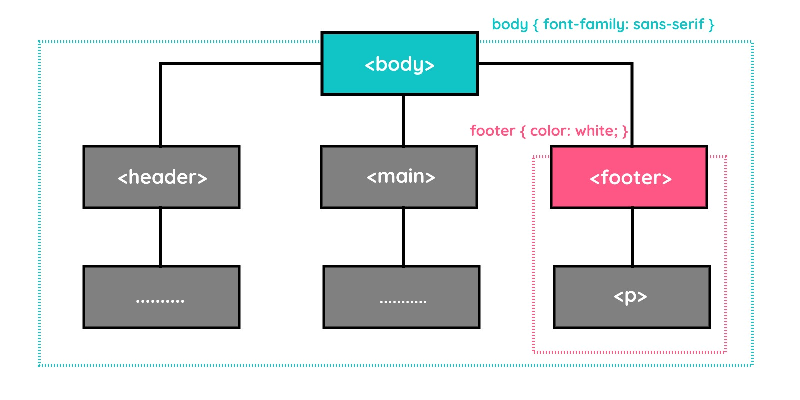

# Inheritance
Styling HTML bersifat inheritance yang dapat mewarisi properti style “tertentu” pada suatu elemen ke elemen-elemen di dalamnya (child-elements).

Contohnya, CSS rules yang ditetapkan untuk elemen <body> akan diterapkan pada seluruh child-elements secara otomatis. Contoh lainnya, CSS rules yang diterapkan pada elemen <footer> dengan properti color: white akan diterapkan pada seluruh elemen yang ada di dalamnya. Hal ini menjadi alasan memahami struktur dokumen itu penting.

code nya 1.Inheritance.html

Berikut adalah hasil representasi dari contoh studi kasus di atas.

# Group Selector
Jika beberapa selector yang berbeda memiliki penerapan properti-propeti yang sama, kita dapat menggabungkan selector tersebut menggunakan group selector. Hal ini dapat meminimalisir penulisan kode yang berulang.

# Rule Order
Sesuai dengan namanya, cascading artinya “mengalir”. Demikian halnya dengan alur kerja CSS dalam membaca kode, mengalir dari atas ke bawah. Oleh karena itu, kita harus memperhatikan urutan dalam penulisan rules, terutama saat terjadi sebuah konflik.

Konflik dapat terjadi karena kita menerapkan beberapa styling pada satu dokumen HTML dan menimpa styling yang telah diterapkan sebelumnya, baik disadari maupun tidak. Contohnya, apa yang akan ditampilkan oleh browser ketika eksternal css mengharuskan elemen 
 menampilkan warna merah, tetapi pada embedded css 
 harus menampilkan warna biru? Kembali pada alur kerja CSS yang membaca dari atas ke bawah sehingga warna yang akan diterapkan adalah warna yang paling akhir didefinisikan. 

Untuk lebih jelasnya, kita bisa lihat contoh berikut.
<!DOCTYPE html>
<html>
  <head>
    <meta charset="UTF-8" />
    <title>Judul Dokumen</title>

    <link rel="stylesheet" href="style.css">
  </head>
  <body>
    

      Sesuai dengan namanya cascading yang artinya <q>mengalir</q>, alur kerja CSS dalam membaca
      kode pun seperti itu. Mengalir dari atas ke bawah sehingga kita harus memperhatikan urutan
      dalam penulisan rules <i>styling</i>
    

  </body>
</html>

Namun, kita bisa membuat sebuah property styling agar dianggap penting oleh browser untuk diterapkan dan tidak memperhatikan urutan. Kita bisa menambahkan keyword !important pada akhir nilai propertinya.

<!DOCTYPE html>
<html lang="en">
  <head>
    <meta charset="UTF-8" />
    <title>Judul Dokumen</title>

    <link rel="stylesheet" href="style.css">
  </head>
  <body>
    

      Sesuai dengan namanya cascading yang artinya <q>mengalir</q>, alur kerja CSS dalam membaca
      kode pun seperti itu. Mengalir dari atas ke bawah sehingga kita harus memperhatikan urutan
      dalam penulisan rules <i>styling</i>
    

  </body>
</html>

Gunakan !important ketika memang benar-benar dibutuhkan saja. Sebaiknya kita pahami aturan urutan pada CSS dengan baik sehingga meminimalisir penggunaan tanda tersebut.

Berikut catatan yang sudah kita pelajari sejauh ini tentang styling.

* Rule
Sebuah aturan styling yang harus diterapkan pada elemen HTML. Dalam sebuah rule, ada selector dan deklarasi properti styling.
* Selector
Bagian yang mengidentifikasi target elemen untuk menetapkan sebuah rule.
* Declaration
Sebuah bagian dari rule, yang terdiri dari pasangan properti dan nilainya.
* External Style Sheet
Berkas terpisah yang di dalamnya hanya ada satu atau lebih rules yang akan digunakan pada website.
* Embedded Style Sheet
Kumpulan rules yang dituliskan dalam berkas HTML dengan menggunakan elemen <style>.
* Inline Style
Styling yang diterapkan pada elemen HTML dengan menggunakan atribut style.