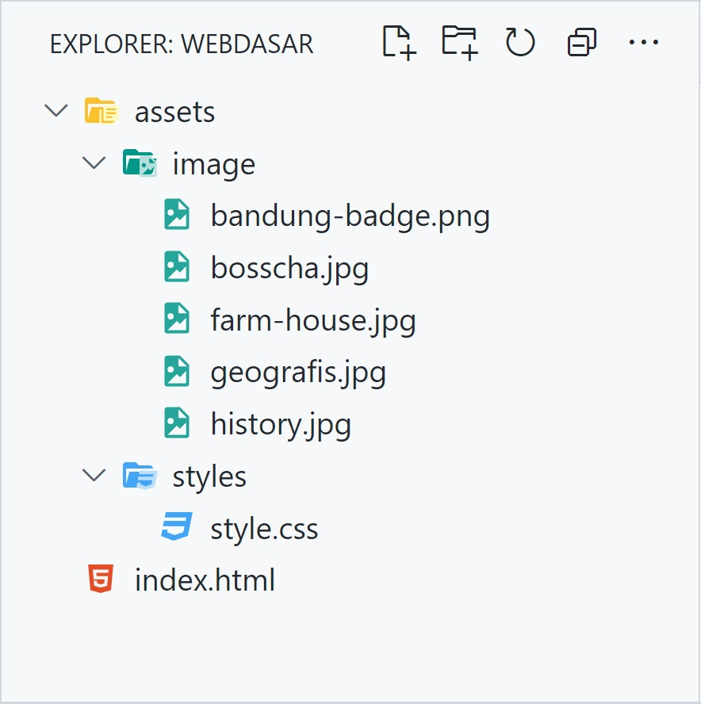
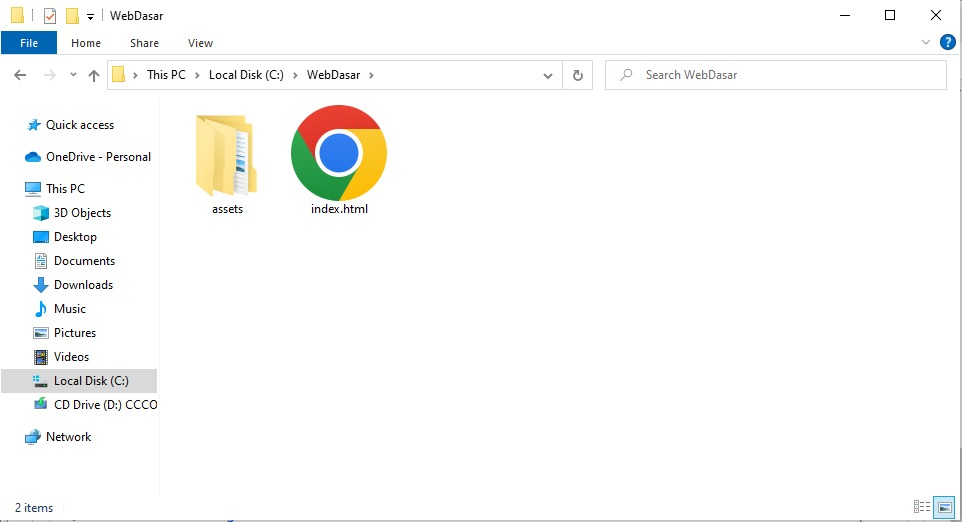
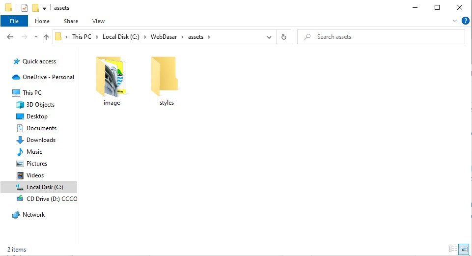
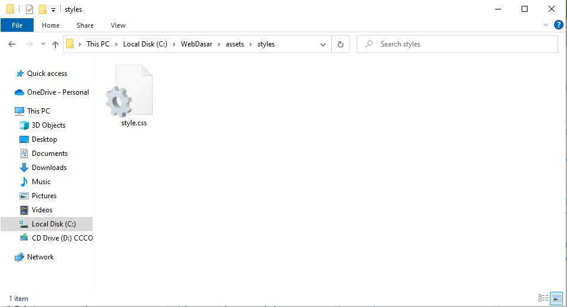

# Latihan: Styling untuk Halaman Profil
Kita sudah belajar tentang menulis aturan dan menghubungkan dokumen HTML dengan styling. Sebagai tahap awal, kita akan berlatih menerapkannya pada latihan ini. Let’s go! 

# Tujuan
Pada Halaman Profil sebelumnya, kita sudah selesai menstruktur ulang konten-konten Kota Bandung dengan elemen-elemen HTML yang sesuai. Kali ini, kita akan beralih ke komponen lain, yaitu styling (CSS).

Kita akan membuat berkas CSS untuk menyediakan styling. Berkas ini akan dikelompokkan dengan folder terpisah. Berikut adalah struktur proyek akhir dari latihan ini.

# Alur Latihan
Berikut adalah alur latihan kali ini.

1. Membuka hasil latihan terakhir dengan VSCode.
2. Membuat folder bernama “styles” untuk menyimpan berkas styling.
3. Membuat berkas CSS bernama style.css dalam folder “styles”.

Silakan ikuti dan simak beberapa langkah berikut untuk mengikuti latihan dengan baik.

1. Silakan buka proyek Halaman Profil terakhir dengan VSCode. Jika belum memilikinya, silakan Anda unduh dan buka proyek tersebut pada GitHub repository ini.
2. Untuk menerapkan styling, kita akan menerapkannya pada folder terpisah. Silakan buka folder assets.

3. Jika Anda sudah mengikuti latihan menampilkan gambar pada HTML, Anda akan menemukan folder image dalam folder assets. Nah, dalam folder assets akan kita tambahkan folder lain, yaitu folder bernama “styles”.

Silakan buat folder tersebut.

4. Folder baru ini akan kita gunakan untuk menyimpan berkas CSS. Silakan buka folder tersebut dan buat berkas baru dengan nama “style.css”. Untuk membuat berkas styling, tentu Anda perlu menggunakan format .css--dibaca: dot css.

5. Sip! Folder styles dan berkas style.css sudah siap untuk dimanfaatkan. Kita akan menggunakan berkas ini untuk proses styling halaman kedepannya.
Ini barulah permulaan latihan dalam menerapkan styling untuk Halaman Profil. Jadi, mari kita lanjutkan latihannya!