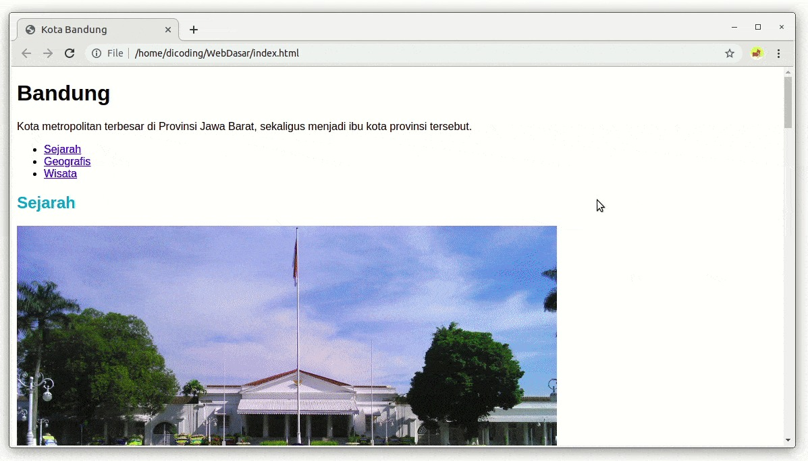

# Pengantar Latihan: Menerapkan Styling Dasar pada Halaman Profil
Sejauh ini, kita telah mengetahui cara menuliskan CSS rule dan menerapkannya pada dokumen HTML. Kita akan berlatih menerapkan beberapa styling dasar pada proyek studi kasus kita Sekarang, yaitu Halaman Profil.

Latihan ini akan mencakup beberapa tahapan, seperti membuat berkas CSS, menuliskan CSS rule, hingga menghubungkan berkas CSS dengan dokumen HTML.

Pada akhir latihan, kita akan mengembangkan proyek ini hingga memiliki hasil berikut.

