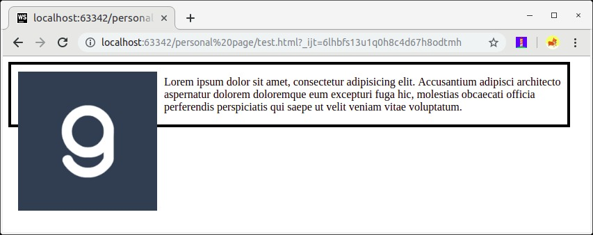

# Clear Property
Cara yang pertama adalah dengan menggunakan properti clear. Properti clear memang dibuat untuk menghilangkan sifat float. Dengan demikian, elemen yang menerapkan properti float akan kembali “dianggap ada”. Namun, untuk menerapkan properti ini kita perlu membuat sebuah elemen kosong (biasanya menggunakan div tanpa konten) yang menerapkan properti clear.

Nilai dari properti clear merupakan nilai yang digunakan pada properti float. Sebab, properti clear akan menghapus sifat float sesuai dengan nilai yang ditetapkan. Contohnya berikut.

<!DOCTYPE html>
<html>
  <head>
    <meta charset="UTF-8" />
    <title>Judul Dokumen</title>
    
    <link rel="stylesheet" href="styles.css" />
  </head>
  <body>
    

      
      

        Lorem ipsum dolor sit amet, consectetur adipisicing elit. Accusantium adipisci architecto
        aspernatur dolorem doloremque eum excepturi fuga hic, molestias obcaecati officia
        perferendis perspiciatis qui saepe ut velit veniam vitae voluptatum.
      

      

    

  </body>
</html>

.container {
  width: 800px;
  border: 4px solid black;
}

img {
  float: left;
  margin: 10px;
}

.clear {
  clear: left;
}

Jika mengubah clear menjadi clear: right, hasilnya akan kembali seperti hasil sebelum menerapkannya.

Lalu, bagaimana jika terdapat dua elemen yang menerapkan nilai float berbeda (left dan right)?  Ada satu nilai lagi yang dapat menghilangkan kedua sifat float tersebut, yakni nilai both. Gunakanlah nilai tersebut jika kita ingin sepenuhnya menghilangkan sifat float pada elemen.