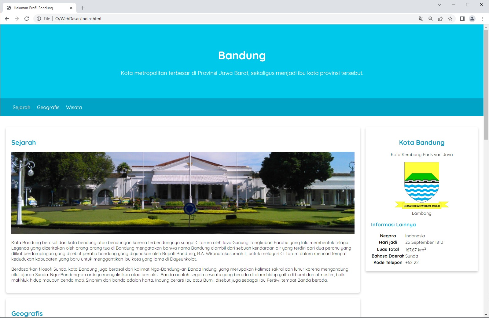
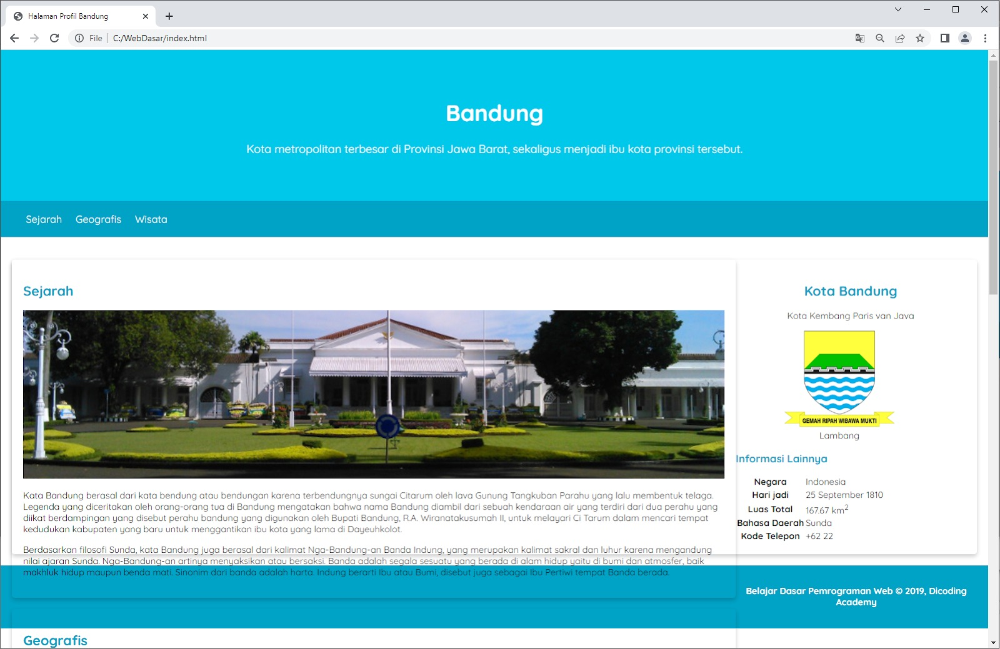
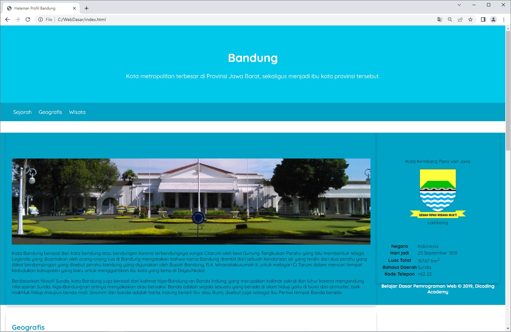
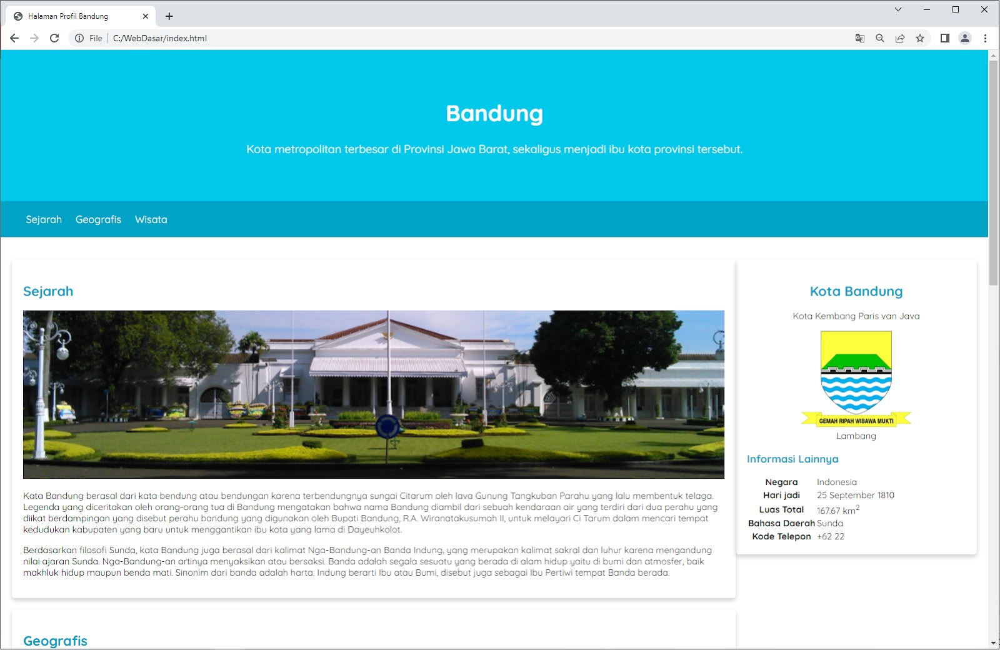
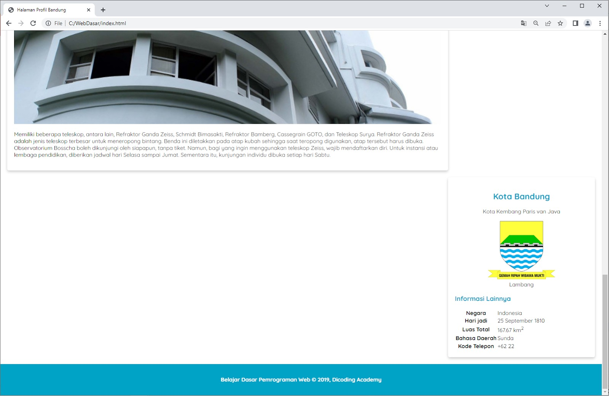

# Latihan: Menerapkan Float pada Elemen Content dan Aside
Teknik layouting dengan float telah kita pelajari. Saatnya, kita lakukan layouting pada proyek studi kasus kita, yaitu Halaman Profil. Kuy!

# Tujuan
Kita akan melakukan layouting atau pengubahan tata letak konten halaman web pada latihan ini. Layouting dilakukan pada elemen 
 dan <aside> agar mereka ditampilkan sejajar secara horizontal. 

Sebagaimana telah dipelajari sebelumnya, kita akan memanfaatkan properti float. Bahkan, Anda sudah melihat pada contoh kasus kecil cara untuk menjajarkan dua elemen secara horizontal. Nah, cara yang dilakukan pada latihan ini seharusnya tidak jauh berbeda.

Berikut adalah hasil akhir dari latihan ini.

# Alur Latihan
Berikut adalah alur latihan kali ini.

1. Membuka hasil latihan terakhir dengan VSCode.
2. Melakukan relayouting halaman web dengan teknik float.
3. Memperbaiki masalah collapse elemen yang terjadi karena float menggunakan overflow auto.
4. Mempertahankan konsistensi ukuran dimensi elemen dengan box-sizing border-box.
5. Menjalankan dokumen HTML pada browser.

# Latihan Menerapkan Float pada Elemen Content dan Aside
Berikut adalah daftar langkah latihan yang perlu diikuti dan disimak agar latihan berjalan dengan baik.

1. Silakan buka proyek Halaman Profil terakhir dengan VSCode. Jika belum memilikinya, silakan Anda unduh dan buka proyek tersebut pada GitHub repository ini.
2. Silakan buka berkas style.css dan buat CSS rule baru dengan selector #content serta berikan properti float dengan nilai left. Kode yang ditambahkan memiliki cetakan tebal.

#content {
  float: left;
}

3. Tambahkan juga nilai lebar elemennya. Pada kasus ini, kita pakai nilai 75% untuk menetapkan lebar #content.
 
#content {
  float: left;
  width: 75%;
}

4. Ketika dibuka hasilnya pada browser, tampilan akan menjadi berantakan seperti berikut.

5. Hal tersebut normal karena kita belum menetapkan nilai float pada elemen <aside>. Oleh karena itu, elemen <aside> dan <footer> akan berpindah menempati ruang yang sebelumnya digunakan oleh #content karena permasalahan keluar dari normal flow.

Kita akan mengatasi masalah di atas secara bertahap. Selanjutnya, kita terapkan juga properti float dengan nilai right pada elemen <aside>.

aside {
  float: right;
}

6. Jangan lupa juga tetapkan ukuran lebar pada elemen <aside>. Elemen content sudah menerapkan 75% lebar dari parent sehingga elemen <aside> hanya dapat memiliki 25% ruang yang tersedia untuk ditempati. Silakan tetapkan nilai 25% pada properti width untuk elemen ini.

aside {
  float: right;
  width: 25%;
}

7. Jika hasil perubahan dijalankan, tampilan akan menjadi lebih mengerikan seperti berikut dari sebelumnya.

8. Hasil di atas terjadi karena tinggi dari elemen <main> sebesar 0 piksel. Mengapa elemen ini menjadi seperti demikian? Hal ini karena elemen #content dan <aside> dianggap tidak ada oleh elemen <main> (parent element) sehingga elemen di bawahnya (<footer>) akan naik mengisi ruang kosong. Agar tidak seperti demikian, kita perlu tetapkan overflow: auto pada elemen <main>.

Silakan tambahkan properti overflow dengan nilai auto pada selector main yang sudah kita miliki sebelumnya.

main {
  padding: 20px;
 
  overflow: auto;
}

9. Setelah itu, tampilan website sudah lebih baik dan elemen <footer> sudah berada pada posisi yang seharusnya.

10. Namun, kita perlu memberikan sedikit jarak horizontal antara 
 dan <aside> agar tidak tampak berhimpitan. Solusinya, tambahkan padding-left pada <aside> agar konten yang ditampilkan dapat rata ke kiri.

Silakan tambahkan properti padding-left dengan nilai 20px pada selector aside.

aside {
  float: right;
  width: 25%;
 
  padding-left: 20px;
}

11. Setelah melakukan perubahan dan membuka kembali hasilnya pada browser, seharusnya tampilan website akan tampak seperti berikut jika halamannya digulir ke bawah.

12. Ups! Letak elemen <aside> berada di bawah #content sekarang. Hal ini karena kita menambahkan padding pada <aside> sehingga lebar elemen sudah bukan 25% lagi.

Untuk mengatasinya, kita bisa ubah tipe pengukuran untuk dimensi kotaknya (elemen). Masih ingat materi tentang box-sizing, kan? Dengan menerapkan nilai border-box pada properti ini, kita dapat menentukan dimensi kotak dengan tepat, tanpa dipengaruhi oleh padding dan border.

Mari kita tetapkan pengukuran box-sizing untuk seluruh elemen HTML dengan menggunakan universal selector seperti berikut.

* {
  box-sizing: border-box;
}

13. Setelah menetapkan rule tersebut, tampilan website akan kembali normal.

Demikian latihan yang sudah kita lakukan. Kita menghadapi rintangan dalam styling Halaman Profil. Cukup menegangkan, bukan? Untuk itulah kita perlu memahami berbagai penerapan CSS dengan baik dan benar.

Nah, untuk selanjutnya, kita masih berlatih untuk meningkatkan styling proyek studi kasus kita. Terus berjuang dan semangatlah!