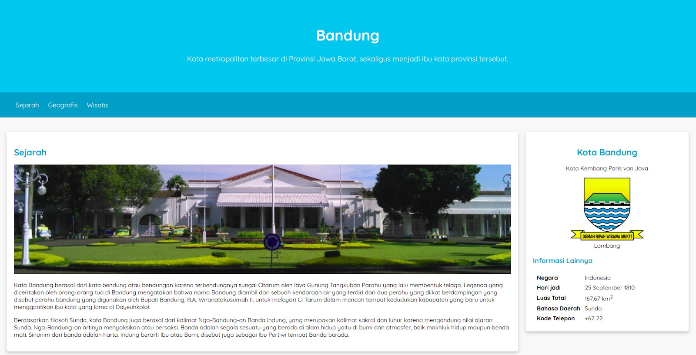
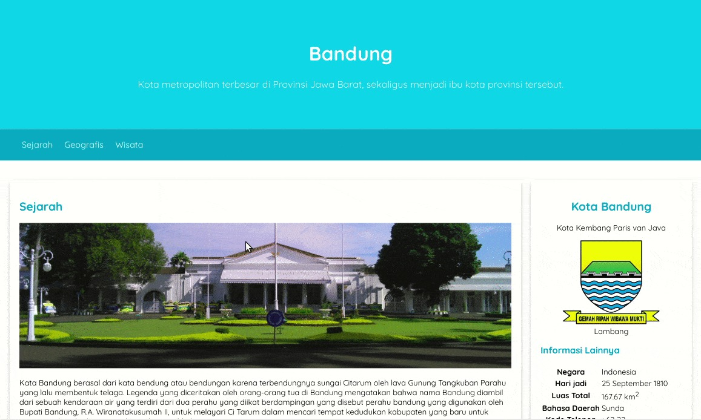

# Pengantar Latihan: Menerapkan Positioning dan Float pada Halaman Profil
Sebagaimana telah disinggung pada latihan sebelumnya, kita akan memindahkan elemen aside agar berada di pinggir halaman halaman detail pada latihan ini. Jadi, tampilan website akan terlihat seperti berikut.

Namun, tidak hanya sampai di situ, latihan ini akan sedikit lebih panjang karena kita akan menerapkan responsibilitas tampilan pada halaman profil dengan menggunakan teknik media query. Seperti apakah tekniknya? Mari kita ketahui bersama. 

Pada akhirnya, kita pasti dapat membuat halaman aplikasi tampak seperti berikut

Anda sudah tidak sabar, kan? Kuy, langsung saja mulai latihannya!