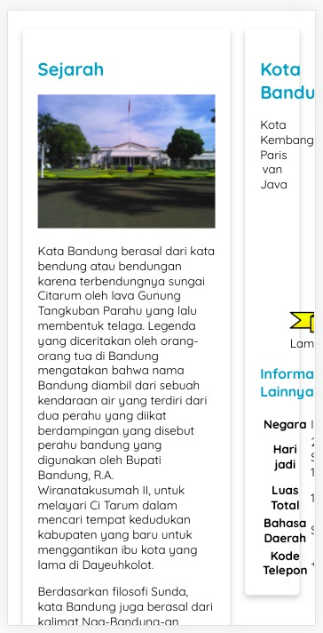

# Specific Style dengan Media Query
Walaupun sudah menetapkan meta tag, viewport tampilan pada mobile device belum baik. Hal ini karena informasi yang ditampilkan pada elemen <article> terlalu sempit, malahan informasi dalam elemen <aside> sulit terbaca.

Untuk mengatasi masalah di atas, CSS menyediakan sebuah fitur untuk menentukan styling hanya pada kondisi browser dan device tertentu yang sesuai dengan aturan yang kita tetapkan. Contohnya, kita memerintahkan ke CSS bahwa “tolong terapkan kode styling ini jika ukuran viewport lebih lebar dari 480 piksel”. Fitur tersebut dinamakan CSS Media Query.

Berikut adalah aturan penulisan media query.
@media media-type and (media-feature-rule) {
  /* CSS rules apa pun ada di sini */
}

Pada aturan di atas, kita dapat jabarkan sebagai berikut.

* Media-type: jenis media sebagai acuan bagi browser dalam menerapkan kode styling. Tipe yang dapat diberikan adalah print, screen, atau semuanya.

* Media-feature-rule: aturan atau kondisi yang harus terpenuhi agar kode styling dapat diterapkan. Kondisi yang dimaksud seperti ukuran viewport, orientasi layar, dan jenis penggunaan perangkat tunjuk (touchsceen, keyboard navigation, atau mouse).

* Media-block: sekumpulan CSS rule yang akan diterapkan jika kedua poin sebelumnya terpenuhi.

Apakah Anda sudah dapat melihat hasil cara kerjanya? Untuk membuktikan bahwa suatu CSS rule diterapkan pada aturan tertentu (di atas 600px dan 992px), silakan perlebar dan persempit ukuran viewport-nya.

<!DOCTYPE html>
<html>
  <head>
    <meta charset="UTF-8" />
    <title>Judul Dokumen</title>
    
    <link rel="stylesheet" href="styles.css" />
  </head>
  <body>
    <header>
      <h1>Penggunaan CSS Media Query</h1>
    </header>

    <main>
      

        <h2>Lorem Ipsum</h2>

        <article>
          <h3>Lorem, ipsum dolor.</h3>
          

            Pellentesque venenatis mi sit amet erat tincidunt auctor. Curabitur tincidunt tellus ac
            convallis dictum. Morbi luctus leo eget leo luctus elementum. Cras at ligula eu elit
            blandit venenatis.
          

        </article>
        <article>
          <h3>Lorem, ipsum dolor.</h3>
          

            Nullam varius ex quis placerat dapibus. Vestibulum bibendum luctus tincidunt. Proin
            cursus velit non magna blandit hendrerit. Vestibulum ante ipsum primis in faucibus orci
            luctus et ultrices posuere cubilia curae; Cras posuere ac tellus a iaculis.
          

        </article>
        <article>
          <h3>Lorem, ipsum dolor.</h3>
          

            Donec pretium orci quis mauris tristique finibus sed sed felis. Nunc luctus dui et ex
            hendrerit, et feugiat ex vehicula.
          

        </article>
      

      <aside>
        <h3>Menu</h3>
        <ul>
          <li>
            <a href="#">Lorem, ipsum.</a>
          </li>
          <li>
            <a href="#">Lorem, ipsum.</a>
          </li>
          <li>
            <a href="#">Lorem, ipsum.</a>
          </li>
          <li>
            <a href="#">Lorem, ipsum.</a>
          </li>
        </ul>
      </aside>
    </main>

    <footer>
      
Hak Cipta &copy; 2023

    </footer>
  </body>
</html>

body {
  font-family: sans-serif;
}

main {
  display: flex;

  flex-direction: column;
}

main aside {
  order: -1;
}

/* CSS rule dalam block @media di bawah akan diterapkan jika ukuran viewport di atas 600px */
@media screen and (min-width: 400px) {
  h1 {
    color: red;
  }

  h2 {
    color: green;
  }
}

/* CSS rule dalam block @media di bawah akan diterapkan jika ukuran viewport di atas 992px */
@media screen and (min-width: 600px) {
  main {
    flex-direction: row;
  }

  #mainContent {
    flex-basis: 70%;
  }

  main aside {
    flex-basis: 30%;

    order: 1;
  }

  h1 {
    color: initial;
  }

  h2 {
    color: initial;
  }

  h3 {
    color: green;
  }
}

Berikut adalah hasil pembuktiannya.

Pada hasil di atas, kita memindahkan elemen <aside> berada di atas elemen 
 saat ukuran viewport di bawah 992px. Jika tidak, kedua elemen tersebut akan dijajarkan secara horizontal. Selain itu, ada styling lainnya yang berubah. Silakan perhatikan dengan saksama pada hasil yang ditampilkan.

Canggih, bukan? Hanya dengan media query, kita dapat memperbaiki masalah responsibilitas halaman web. Sekarang kita dapat memperbaiki permasalahan layout pada proyek studi kasus kita.

Yuk, menuju ke latihan sekarang