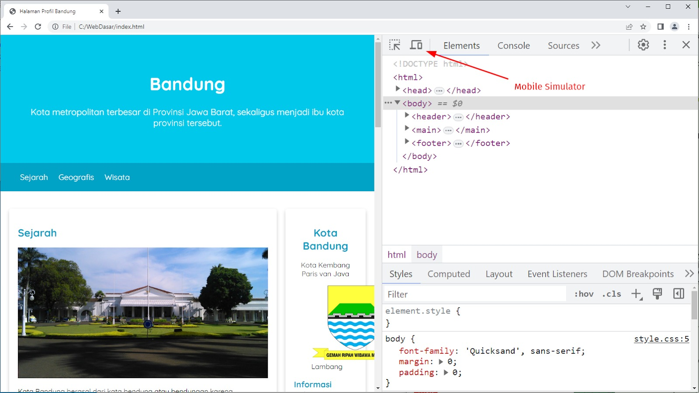
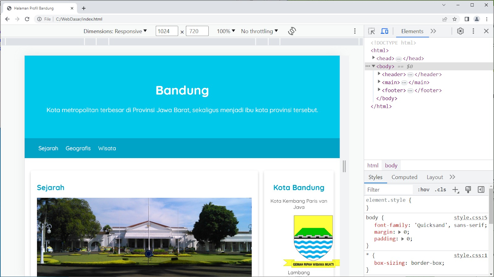
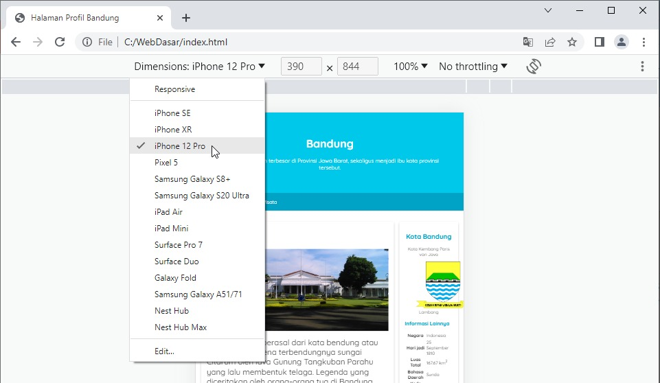
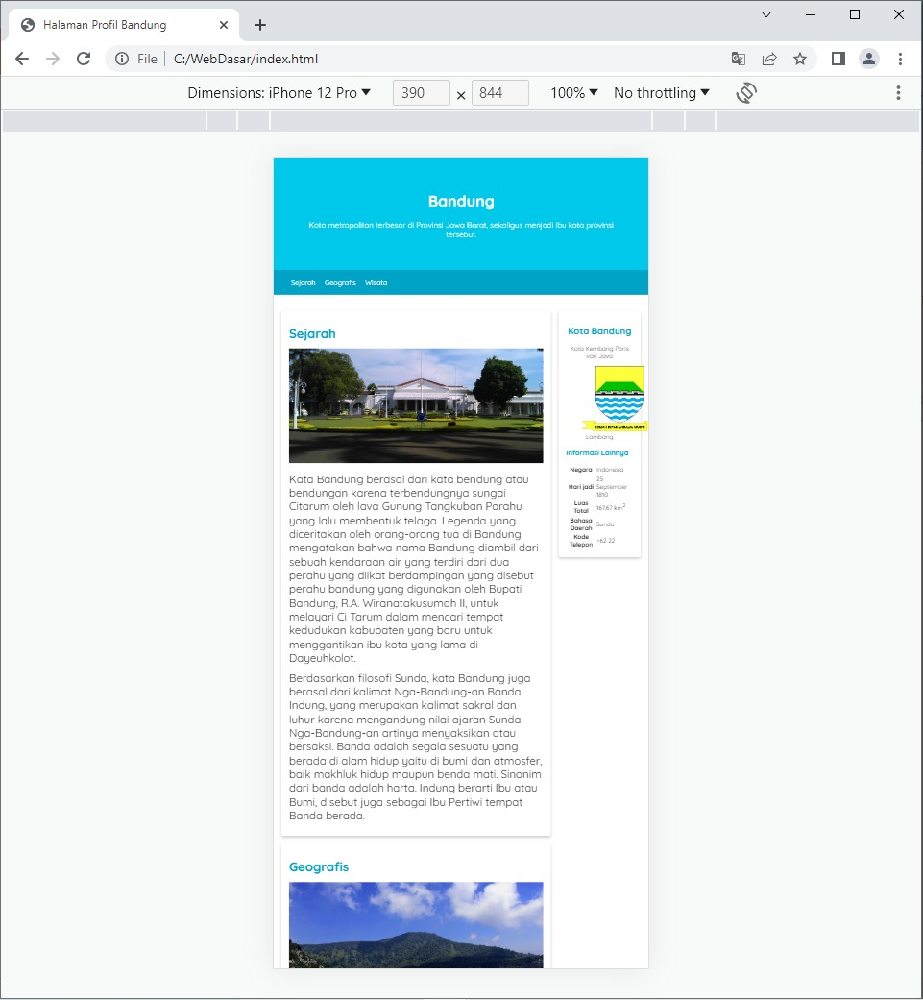
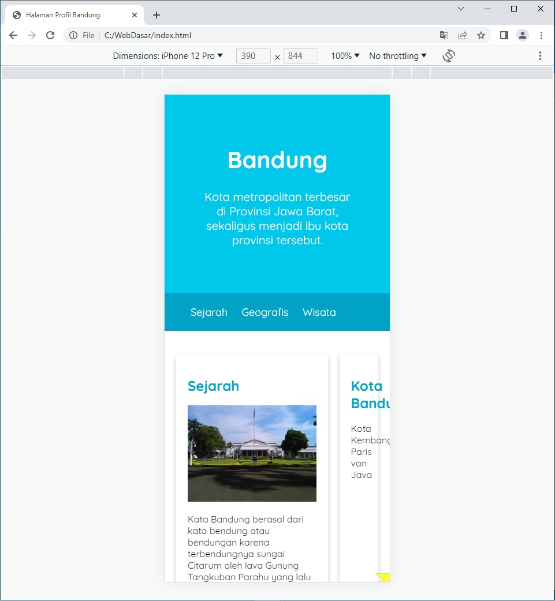

# Konfigurasi Meta Tag Viewport untuk Responsibilitas Layout
Setelah berhasil membuat layout menggunakan float, apakah terpikirkan bagaimana tampilan yang dihasilkan pada mobile device? Tampilan website kita terlihat baik ketika dibuka menggunakan laptop atau desktop, tetapi belum tentu akan sama pada mobile device.

Pada browser Google Chrome dan Mozilla Firefox, ada fitur inspeksi elemen. Fitur ini sangat banyak dan bermanfaat bagi developer web dalam membantu mengembangkan website. Hal yang pasti, pada inspector tersebut, ada fitur yang dapat mensimulasikan halaman website dalam tampilan yang lebih kecil, seperti perangkat mobile atau tablet. Untuk membuka fitur inspector, kita dapat gunakan keyboard shortcut, seperti “CTRL + SHIFT + I” atau klik kanan dan pilih “Inspect”/”Inspect Page”.

Berikut adalah contoh tampilan DevTools pada browser.

mksd nya seperti ini

Kedua gambar di atas menunjukkan fitur inspection pada Google Chrome dan Mozilla Firefox. Untuk mensimulasikan tampilan mobile device, kita dapat menekan icon yang dilingkari pada gambar di atas.

Dengan demikian, tampilan browser akan seperti gambar berikut.

Di sini, kita bisa memilih device apa yang akan digunakan untuk mensimulasikan halaman. Untuk melihat tampilan dalam mobile devices, kita bisa memilih salah satu opsi handphone yang tersedia. Contohnya iPhone 12 Pro.

Lalu, setelah memilih tampilan pada mobile devices, apakah tampilan website sekarang sudah tampak baik? Tentu jawabannya tidak. Hal ini karena tampilan pada simulasi device di browser Google Chrome akan tampak seperti berikut.

Viewport merupakan area yang dapat dilihat oleh pengguna kita pada halaman website. Ukuran viewport bervariasi berdasarkan device-nya. Ukuran viewport pada sebuah peranti mobile lebih kecil dibandingkan dengan layar komputer desktop.

Sebelum adanya tablet ataupun handphone, halaman website didesain hanya untuk ukuran layar komputer desktop. Dengan demikian, banyak sekali website yang menerapkan tampilan dan ukuran yang statis. Jadi, ketika halaman tersebut diakses melalui handphone atau tablet, tampilannya akan mengecil karena tidak disesuaikan.

Untuk mengatasi masalah di atas, kita perlu menetapkan meta tag viewport untuk mengendalikan dan menentukan bentuk dari viewport browser, terutama pada perangkat mobile. Jadi, kita dapat melihat ukuran halaman web layaknya diakses pada desktop device. Namun, hal tersebut tetap memerlukan penggunaan teknik peningkatkan responsibilitas karena ukuran viewport-nya yang berbeda–kita akan mempelajari ini pada materi berikutnya.

Mengatur viewport dapat dilakukan melalui tag <meta> yang disisipkan dalam elemen <head>. Contohnya berikut.
<meta name="viewport" content="width=device-width, initial-scale=1">

Seharusnya sekarang tampilan pada mobile device menjadi seperti berikut.

Terlihat lebih baik, bukan? Tampilan halaman web sudah tidak kecil lagi dan level kebesarannya terlihat sama dengan tampilan yang dibuka pada layar desktop.

Jika ingin mempelajari lebih lanjut mengenai fitur ini, Anda bisa melihat detailnya pada dokumentasi yang disediakan pada tautan berikut.

Namun, permasalahan lain muncul. Elemen <article> terlalu kecil dan sempit dan elemen <aside> tidak ditampilkan dengan baik. Kami tahu Anda merasa resah dengan hal tersebut. Sebagaimana telah disinggung sebelumnya, kita akan memerlukan teknik peningkatan responsibilitas pada halaman web. Namun, jangan khawatir. Kita akan mempelajari teknik ini pada materi selanjutnya.

Sudah siap, kan?