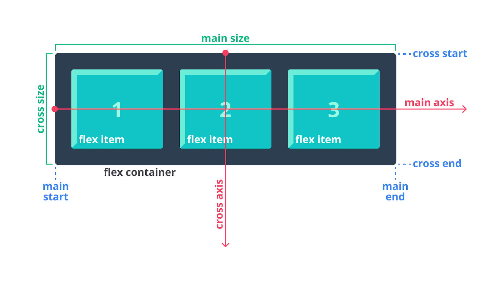

# Dasar-Dasar dan Terminologi Flexbox
Pertama, mari kita pahami terlebih dahulu mengenai istilah-istilah yang digunakan di flexbox. Dalam penggunaannya, flexbox bukanlah properti yang bekerja secara sendiri. Flexbox dapat melakukan banyak hal dengan melibatkan berbagai properti pendukung. Beberapa di antaranya digunakan oleh flex container dan sebagian lainnya digunakan oleh flex items.

Pada dasarnya, arah flow didasarkan pada flow dari elemen block (vertical) dan flow dari elemen inline (horizontal). Flexbox sendiri memiliki arah layout yang didasarkan pada flex-direction. Untuk memperjelasnya, perhatikan gambar di bawah ini.

Pada gambar di atas, terlihat bahwa terdapat dua istilah khusus pada elemen yang menerapkan flexbox, yaitu flex container dan flex item. *Flex container adalah parent elemen dari seluruh flex items*, sedangkan flex items adalah elemen yang secara langsung merupakan child dari parent element.

Pada asalnya, flex items akan dijejerkan secara horizontal (row), yaitu dimulai dari main-start ke main-end (main axis). Namun, jangan khawatir, kita bisa mengubahnya menggunakan properti yang memiliki peran tersebut. Kita akan mempelajarinya di submodul mendatang.

* Main axis: main axis dari flex container adalah arah sumbu utama yang mana flex items akan dijejerkan atau ditata. Perlu diingat, arah dari main axis tidak selalu horizontal. Hal ini bergantung terhadap value dari properti flex-direction.

* Main-start | main-end: flex items akan ditempatkan dalam flex container yang berawal dari main-start dan main-end.

* Main size: main size merupakan lebar atau tinggi dari flex item yang diposisikan pada sumbu utama (main axis).

* Cross axis: cross axis adalah sumbu yang arahnya tegak lurus dengan main axis. Biasanya ini terjadi ketika flexbox menerapkan value wrap pada properti flex-wrap sehingga susunan layout terlihat dua dimensi.

* Cross-start | cross-end: flex item yang memenuhi ruang kosong flex container secara vertikal, dimulai dari cross-start hingga cross end. Hal ini dapat kita atur menggunakan properti align-items, align-self, dan align-content.

* Cross size: lebar atau tinggi dari sebuah flex item yang ditempatkan pada dimensi cross.