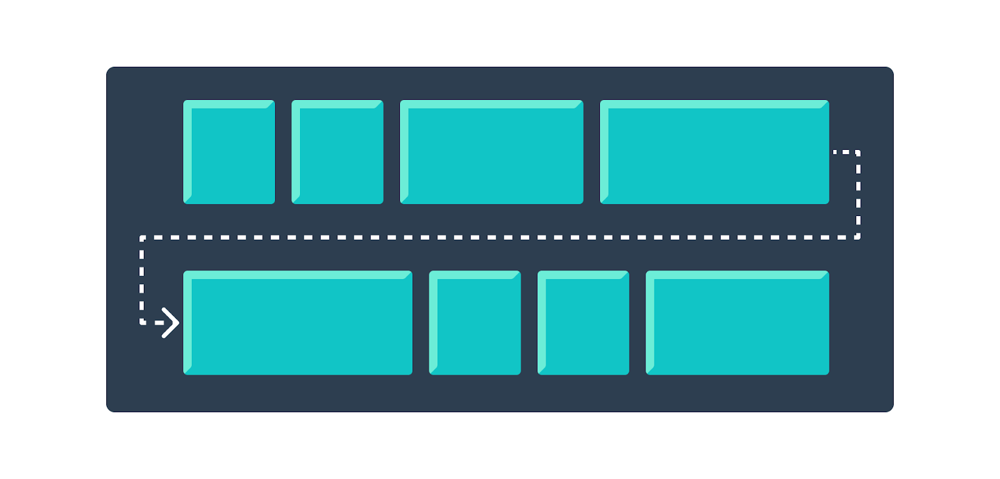
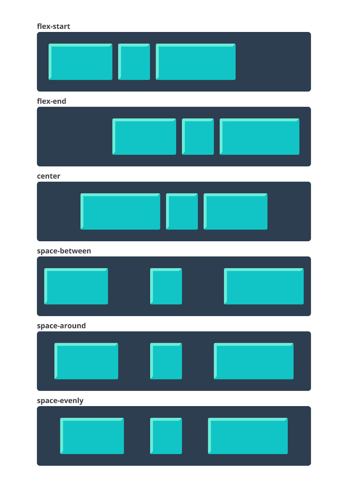
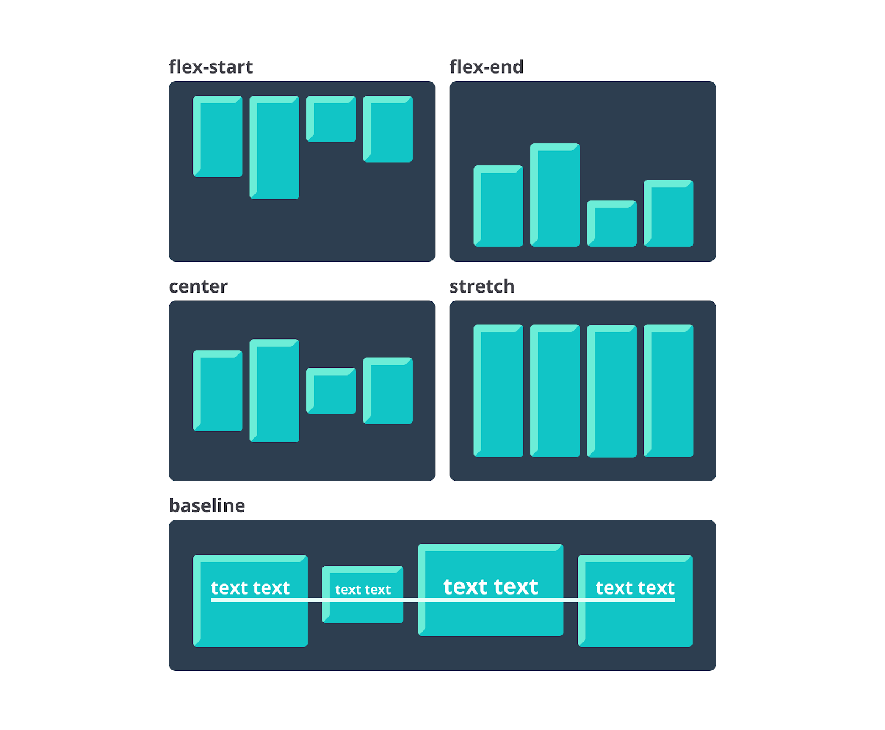
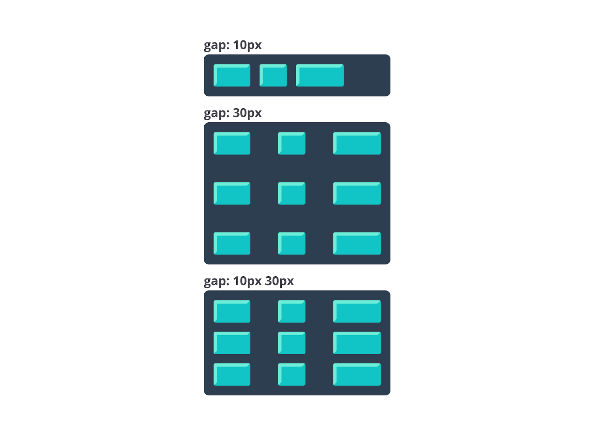

# Properti-Properti pada Flex Container
Pada materi ini, kita akan berkenalan terlebih dahulu dengan properti-properti yang dilibatkan kepada flex container (parent element). Properti-properti ini akan berpengaruh secara langsung kepada flex items dalam menampilkan susunannya.

1. Display
Di materi sebelumnya, kita telah menggunakan properti display untuk mengatur sifat elemen dengan value block dan inline. Nah, kali ini, jika kita ingin mendefinisikan elemen agar disusun sebagai flexible box, kita dapat menggunakan properti yang sama.

.container {
  display: flex;
}

2. Flex direction

Di materi sebelumnya, kita telah memahami bahwa flex items akan disusun sesuai main-axis (arah sumbu utama). Pada dasarnya, flexbox mengatur elemen secara satu dimensi (terlepas dari permasalahan wrapping). Dengan begitu, untuk menentukan arah susunan flex items, kita bisa definisikan menggunakan properti flex-direction. Secara default, value ini adalah row.

.container {
  display: flex;
  flex-direction: row | row-reverse | column | column-reverse;
}

Berikut adalah penjelasan value dari properti flex-direction.
a. row: flex items akan disusun secara horizontal dari kiri ke kanan.

b. row-reverse: flex items akan disusun secara horizontal, tetapi berarah terbalik (kanan ke kiri).

c. column: flex items akan disusun secara vertikal dari atas ke bawah.

d. column-reverse: flex items akan disusun secara vertikal, tetapi dengan arah terbalik (bawah ke atas).

3. Flex wrap

Pada mulanya, ketika layout dari parent element disusun menggunakan flexbox, flex items akan selalu diletakkan dalam satu baris (satu dimensi). Dengan properti flex-wrap, kita bisa mengubah perilakunya menjadi dua dimensi (jika dibutuhkan). Secara bawaan, value dari properti ini adalah nowrap.

.container {
  display: flex;
  flex-wrap: nowrap | wrap | wrap-reverse;
}

Berikut adalah penjelasan setiap value dari properti 
a. flex-wrap.
nowrap: flex items hanya akan ditempatkan dalam satu baris.

b. wrap: flex items akan ditampilkan dalam multiple lines, yakni dari atas ke bawah.

c. wrap-reverse: flex items akan ditampilkan dalam multiple lines, tetapi dari arah bawah ke atas.

4. Justify content

Terdapat kasus di mana kita perlu meletakkan child element agar berada di tengah secara horizontal, jarak antar child element setara, dsb. Sebelum kita mengenal flexbox, untuk mencapai hal tersebut diperlukan penentuan nilai secara eksplisit, misalnya dengan properti margin agar jarak antar elemen sesuai yang diinginkan. Tentu saja hal ini menjadi rumit dan membuat kita frustasi.

Pada flexbox, permasalahan tersebut terwujudkan dengan mudah menggunakan properti justify-content. Properti ini akan mengatur posisi child elemen pada main axis. Kemudahan ini tentu akan sangat dirasakan ketika membuat tampilan yang responsif.

.container {
  display: flex;
  justify-content: flex-start | flex-end | center | space-between | space-around | space-evenly;
}

Berikut adalah penjelasan setiap value dari properti justify-content.
a. flex-start: peletakan child element akan dimulai dari main-start.

b. flex-end: peletakan child element dimulai dari main-end.

c. center: child element akan diletakkan di tengah parent child.

d. space-between: child element akan tersusun secara merata, elemen pertama berada di tepi main-start dan elemen kedua berada di tepi main-end. Jika child element lebih dari dua, elemen lainnya akan didistribusikan berada di tengah dengan jarak yang sama.

e. space-around: setiap child elemen akan memiliki panjang celah yang sama pada sisi horizontal.

f. space-evenly: setiap child elemen akan memiliki jarak yang setara, termasuk jarak ke tepi main-start dan main-end.

5. Align items

Properti ini memiliki perilaku bagaimana menempatkan flex items sepanjang cross axis. Bayangkan bahwa tingkah laku dari properti ini mirip dengan properti justify-content, tetapi mengatur child element dalam satu baris pada cross axis.

.container {
  display: flex;
  align-items: stretch | flex-start | flex-end | center | baseline;
}

Berikut adalah penjelasan setiap value dari properti align-items.
a. stretch: melebar hingga memenuhi container dalam cross axis. Setiap child element akan memiliki nilai height yang sama, meskipun isi konten berbeda.

b. flex-start: setiap child elemen akan memiliki ukuran height sesuai dengan isi konten serta seluruhnya akan berada di tepi cross-start.

c. flex-end: setiap child element akan memiliki ukuran height sesuai dengan isi konten serta seluruhnya akan berada di tepi cross-end.

d. center: setiap child elemen memiliki ukuran height sesuai dengan isi konten dan secara vertikal posisi elemen berada di tengah.

e. baseline: nilai pada asalnya akan menyerupai flex-start. Namun, jika konten pertama pada masing-masing child element memiliki ukuran height yang berbeda, child element lainnya akan menyesuaikan posisinya secara cross axis dari cross-start.

6. Align content

Properti ini melakukan perataan terhadap flex items di setiap baris pada cross-axis. Tingkah laku properti ini hampir mirip dengan properti justify-content yang mengatur tata letak flex items di sisi main axis.

Hal yang perlu diperhatikan adalah penggunaan properti ini hanya akan berpengaruh pada multi-line flex container, yang mana properti flex-wrap dilibatkan. Flex container yang hanya memiliki single line tidak akan memiliki efek diterapkannya properti align content.

.container {
  display: flex;
  align-content: flex-start | flex-end | center | space-between | space-around | space-evenly;
}

Berikut adalah penjelasan dari setiap value dari properti ini.
normal (default): Jika kita tidak menerapkan value pada align content, flex items akan diposisikan secara default.

flex-start: flex items di tata pada permulaan flex container.

flex-end: flex items di tata pada akhir flex container.

center: flex items diposisikan di tengah flex container.

space-between: flex items akan disebar secara merata, yang mana item pertama akan diposisikan pada cross-start dan item terakhir akan diposisikan pada cross-end.

space-around: flex items akan disebar secara merata dengan jarak celah yang sama juga.

space-evenly: flex items akan disebar secara merata dengan jarak yang merata juga.

7. Gap (celah)

Sering kali kita ingin memberikan jarak atau celah pada flex items. Biasanya kita akan mengandalkan properti margin dalam hal ini. Namun, ada cara yang lebih efektif, yaitu menggunakan properti gap.

.container {
  display: flex;
  gap: 1rem; /*diterapkan secara vertikal dan horizontal dengan nilai yang sama*/
  gap: 1rem 2rem; /*diterapkan secara vertikal dan horizontal*/
  row-gap: 1rem; /*diterapkan secara horizontal*/
  column-gap: 1rem; /*diterapkan secara vertikal*/
}

