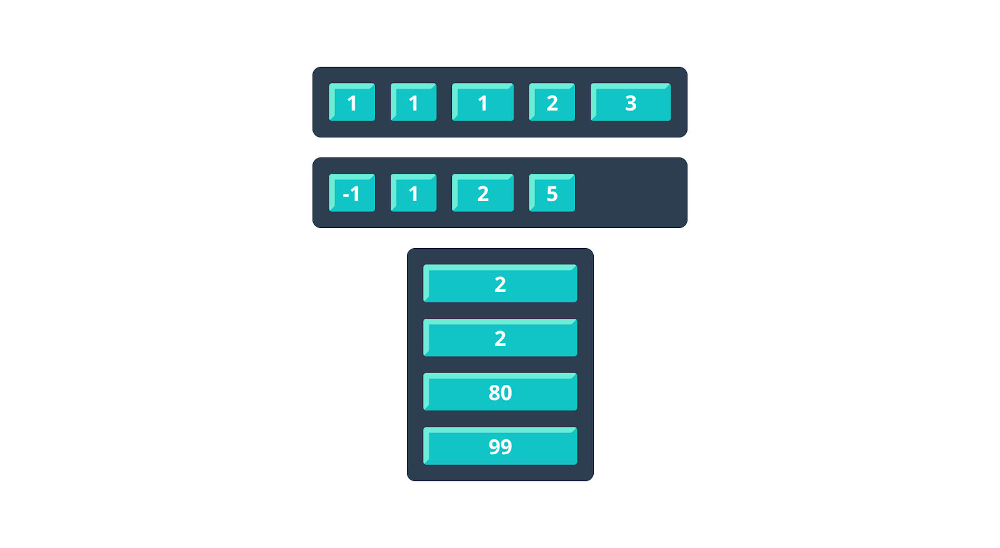
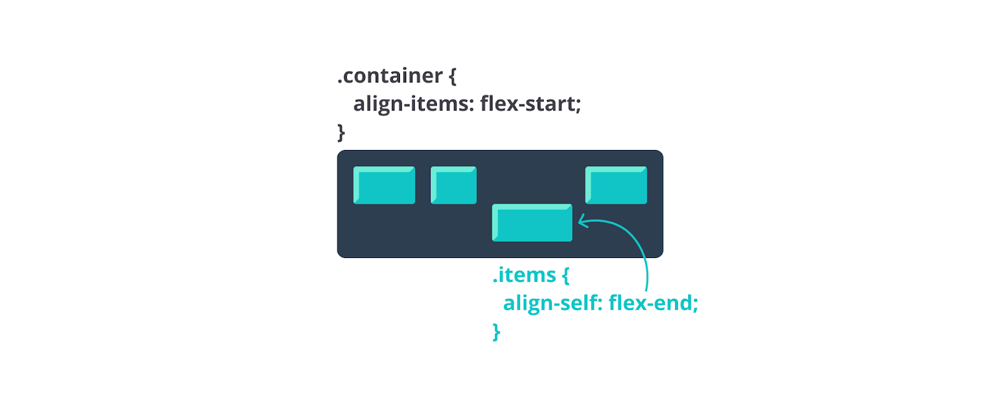

# Properti-Properti pada Flex Items
Pada submodul sebelumnya, kita telah mempelajari properti-properti pendukung pada flex yang diterapkan untuk flex container. Nah, sekarang kita akan membahas properti-properti yang digunakan pada flex items.

1. Order

Secara asalnya, flex items akan diletakkan sesuai dengan urutan penulisan kode. Namun, dengan properti order, kita bisa mengatur urutan susunan flex items.
.item {
  order: 5; /*default is 0*/
}

2. Flex grow

Ketika kita membuat layout dengan flexbox, flex item akan dijejerkan serta memiliki lebar sesuai dengan ukuran kontennya. Bisa saja flex container akan meninggalkan sisa ruang meski ukuran konten dari flex items tidak memenuhi flex container. Jika Anda tidak nyaman dengan layout seperti ini, kita dapat mengatur flex items agar selalu memenuhi flex container. Di sinilah peran properti flex grow. Properti ini akan melakukan grow pada main axis sehingga tidak akan menyisakan ruang kosong pada flex container.

Flex grow akan melakukan pendistribusian sisa ruang dalam container kepada seluruh child element dengan porsi yang sama (adil). Jika salah satu child elemen memiliki flex grow dengan nilai dua, child element tersebut akan mendapatkan pembagian porsi dua kali lebih besar dibanding child element yang hanya memiliki satu porsi. Nilai yang diberikan pada properti ini adalah angka tanpa satuan (unitless).

.item {
  flex-grow: 1; /*default is 0*/
}

3. Flex shrink
Properti ini memiliki kemampuan untuk menyusutkan atau menciutkan ukuran child element jika ukurannya tidak mencukupi ruang container. Nilai yang diberikan pada properti ini adalah angka tanpa satuan (unitless).

.item {
  flex-shrink: 0; /*default is 1*/
}

Secara default, nilai dari properti ini adalah 1. Jika kita memberikan nilai 0, ukuran child element tidak akan menciut.

4. Flex basis
Properti ini akan memberikan ukuran default sebelum sisa ruang container didistribusikan kepada flex items. Nilai yang didukung untuk properti ini terkait ukuran dimensi (width dan height), yaitu 2rem, 20%, dan lainnya.

.item {
  flex-basis: 1rem | 25% | auto; /*default is auto*/
}

5. Align self

Properti ini memiliki tingkah laku yang sama dengan properti align items. Properti ini dapat mengatur posisi child element secara cross-axis. Namun, properti ini hanya berlaku untuk child element. Jika kita ingin mengecualikan child element di antara child element lainnya, gunakanlah properti ini.

.items {
  align-self: auto | flex-start | flex-end | center | baseline | stretch; /*default is auto*/
}