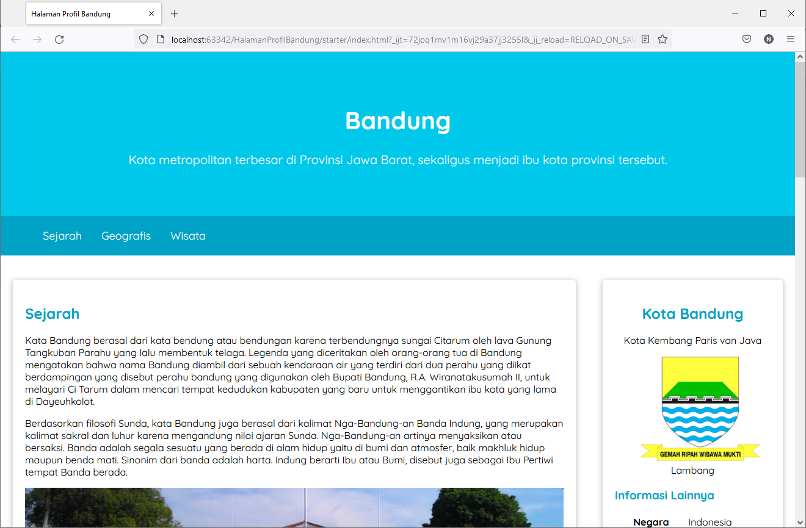
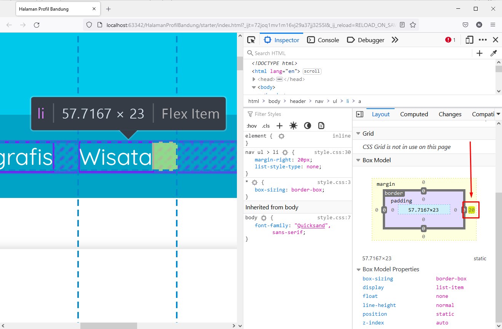

# Implementasi Flexbox pada Halaman Profil Bandung
Selamat! Anda sudah mengenal dan memahami materi seputar flexbox, seperti apa itu flexbox, mengapa harus menggunakan flexbox, dan properti apa saja yang terlibat. Tidak cukup jika kita hanya mengetahuinya secara teori. Sekarang waktunya kita berlatih menerapkan flexbox pada proyek Halaman Profil Bandung yang telah kita kembangkan sebelumnya. 

Terdapat dua elemen yang akan kita terapkan menggunakan flexbox, yakni navigation bar dan konten utama.

Pertama-tama, kita buka terlebih dahulu proyek sebelumnya. Jika Anda belum memiliki proyek tersebut, silakan unduh terlebih dahulu pada tautan ini.

Hal pertama yang akan kita terapkan menggunakan flexbox adalah navigation bar. Buka berkas style.css pada direktori assets/styles dan tambahkan CSS rule baru untuk elemen nav ul beserta propertinya sehingga kode menjadi seperti berikut.

 
nav ul {
  padding-inline: 4rem;
  display: flex;
}

Seperti yang tertera pada kode di atas, kita menggunakan properti padding-inline. Perilaku dari properti tersebut sama seperti properti padding pada umumnya. Hanya saja, properti padding-inline membuat padding secara horizontal. Jika ada yang bertanya-tanya, “Berarti ada properti padding-block juga ya?” Jawabannya adalah, “Yup! Benar sekali.” Properti padding-block membuat padding secara vertikal.

Kemudian, hilangkan properti display: inline pada selector nav li sehingga CSS rule untuk selector tersebut menjadi seperti di bawah ini. 

nav li {
  list-style-type: none;
  margin-right: 20px;
}

Hal ini dikarenakan flexbox memiliki kendali untuk mengatur layout dalam satu dimensi (horizontal atau vertikal) sehingga jika kita terapkan display: inline atau display: block, tidak akan memengaruhi flex items sama sekali.

Jika dijalankan melalui browser, navigasi bar akan terlihat seperti berikut.

Hasil di atas memang terlihat tidak ada perubahan apa-apa karena kita hanya mengubahnya menjadi flex. Selain itu, ada satu hal yang dapat kita perbaiki agar lebih efektif, yaitu gap. Seperti yang kita lihat, setiap tombol navigasi bar memiliki jarak sehingga terlihat renggang atau tidak berdempetan. Hal ini karena kita menggunakan properti margin-right pada setiap elemen <li>. Konsekuensinya, tombol navigasi terakhir (“Wisata”) akan tetap memiliki margin di sisi kanan sehingga ini akan sia-sia karena hal tersebut tidak dibutuhkan.

Dari permasalahan di atas, kita akan menggunakan gap untuk memberikan jarak atau celah antar tombol navigasinya sebagai solusi. Silakan tambahkan properti gap pada selector nav ul dan hilangkan properti margin-right pada selector nav li sehingga kodenya akan terlihat seperti berikut.

Selanjutnya, hal kedua yang akan kita terapkan menggunakan flexbox adalah konten utama (elemen main). Hal utama yang perlu diperhatikan adalah kita akan mengubah penggunaan float menjadi flexbox sebagai penyusunan layout. Di dalam elemen main, terdapat elemen #content dan elemen aside. Elemen-elemen ini akan kita jadikan flex-items. Untuk itu, kita akan menambahkan properti display: flex pada elemen main agar menjadi flex container. Selain itu, kita hilangkan juga properti overflow: auto pada selector tersebut sehingga CSS rule dari selector main akan menjadi seperti berikut.

main {
  padding: 20px;
 
  display: flex;
  gap: 1.5rem;
}

Setelah itu, kita perlu menghapus seluruh properti yang diterapkan pada elemen #content dan elemen aside karena kita tidak menggunakan float lagi. Sebagai gantinya, kita akan menerapkan properti flex: 5 pada #content dan properti flex: 1 pada elemen aside. Silakan sesuaikan kode CSS pada elemen #content dan aside menjadi seperti di bawah berikut.

#content {
  flex: 5;
}
 
aside {
  flex: 1;
}

Pada kode di atas, kita menggunakan properti flex. Properti ini merupakan properti shorthand yang mencakup tiga buah properti, yaitu flex-grow, flex-shrink, dan flex-basis (jika lupa, Anda dapat membuka kembali materi sebelumnya). Terdapat beberapa opsi nilai saat memberikan value pada properti flex. Silakan perhatikan kode berikut.

.item {
  flex: 0; /*flex-grow*/
}
.item {
  flex: 0 1; /*flex-grow flex-shrink*/
}
.item {
  flex: 0 auto; /*flex-grow flex-basis*/
}
.item {
  flex: 0 1 auto; /*flex-grow flex-shrink flex-basis*/
}

Dengan demikian, keseluruhan kode akan menjadi seperti berikut.

@import url("https://fonts.googleapis.com/css?family=Quicksand:400,700&display=swap");
 
* {
  box-sizing: border-box;
}
 
body {
  font-family: "Quicksand", sans-serif;
  margin: 0;
  padding: 0;
}
 
header {
  display: inline;
}
 
nav {
  background-color: #00a2c6;
  padding: 5px;
  position: sticky;
  top: 0;
}
 
nav ul {
  padding-inline: 4rem;
 
  display: flex;
  gap: 2rem;
}
 
nav li {
  list-style-type: none;
}
 
nav a {
  font-size: 18px;
  font-weight: 400;
  text-decoration: none;
 
  color: white;
}
 
nav a:hover {
  font-weight: bold;
}
 
main {
  padding: 20px;
  display: flex;
  gap: 1.5rem;
}
 
aside {
  flex: 1;
}
 
footer {
  padding: 20px;
  color: #fff;
  background-color: #00a2c6;
}
 
h2 {
  color: #00a2c6;
}
 
h3 {
  color: #00a2c6;
}
 
#content {
  flex: 5;
}
 
.jumbotron {
  font-size: 20px;
  padding: 60px;
  background-color: #00c8eb;
  text-align: center;
  color: white;
}
 
.profile header {
  text-align: center;
}
 
.featured-image {
  width: 100%;
  max-height: 300px;
 
  object-fit: cover;
  object-position: center;
}
 
.profile img {
  width: 200px;
}
 
.card {
  box-shadow: 0 2px 8px 2px rgba(0, 0, 0, 0.2);
  border-radius: 5px;
  padding: 20px;
  margin-top: 20px;
}
 
@media screen and (max-width: 1000px) {
  #content,
  aside {
    width: 100%;
    padding: 0;
  }
}

Gambar yang dihasilkan memang tidak terlihat perubahan apa-apa. Namun, kita telah berhasil menerapkan flexbox pada elemen main atau konten utama.

Gambar yang dihasilkan memang tidak terlihat perubahan apa-apa. Namun, kita telah berhasil menerapkan flexbox pada elemen main atau konten utama.

Selanjutnya, kita akan membuat layout untuk setiap card menggunakan flexbox. Pada elemen #content, tambahkan properti display: flex dan properti pendukung lainnya sehingga kode CSS elemen #content akan terlihat seperti berikut.

#content {
  flex: 5;
 
  display: flex;
  flex-flow: column nowrap;
}

Pada kode CSS di atas, seperti properti flex, kita menemukan lagi properti shorthand lainnya, yaitu flex-flow. Properti tersebut mencakupi dua buah properti, yaitu flex-direction dan flex-wrap. Terdapat beberapa cara penggunaanya.

.item {
  flex-flow: column; /*flex-direction*/
}
 
.item {
  flex-flow: wrap; /*flex-wrap*/
}
 
.item {
  flex-flow: column wrap; /*flex-direction flex-wrap*/
}

Sebagaimana sebelumnya, kita akan menggunakan properti gap untuk memberi jarak celah setiap artikel. Kita beri properti tersebut pada selector #content dan hapus properti margin-top yang terapkan pada selector .card. Silakan sesuaikan kode CSS pada elemen #content dan .card menjadi seperti berikut.

Kode keseluruhan akan menjadi seperti berikut.

@import url("https://fonts.googleapis.com/css?family=Quicksand:400,700&display=swap");
 
* {
  box-sizing: border-box;
}
 
body {
  font-family: "Quicksand", sans-serif;
  margin: 0;
  padding: 0;
}
 
header {
  display: inline;
}
 
nav {
  background-color: #00a2c6;
  padding: 5px;
  position: sticky;
  top: 0;
}
 
nav ul {
  padding-inline: 4rem;
 
  display: flex;
  gap: 2rem;
}
 
nav li {
  list-style-type: none;
}
 
nav a {
  font-size: 18px;
  font-weight: 400;
  text-decoration: none;
 
  color: white;
}
 
nav a:hover {
  font-weight: bold;
}
 
main {
  padding: 20px;
  display: flex;
  gap: 1.5rem;
}
 
aside {
  flex: 1;
}
 
footer {
  padding: 20px;
  color: #fff;
  background-color: #00a2c6;
}
 
h2 {
  color: #00a2c6;
}
 
h3 {
  color: #00a2c6;
}
 
#content {
  flex: 5;
 
  display: flex;
  flex-flow: column nowrap;
  gap: 1rem 2rem;
}
 
.jumbotron {
  font-size: 20px;
  padding: 60px;
  background-color: #00c8eb;
  text-align: center;
  color: white;
}
 
.profile header {
  text-align: center;
}
 
.featured-image {
  width: 100%;
  max-height: 300px;
 
  object-fit: cover;
  object-position: center;
}
 
.profile img {
  width: 200px;
}
 
.card {
  box-shadow: 0 2px 8px 2px rgba(0, 0, 0, 0.2);
  border-radius: 5px;
  padding: 20px;
}
 
@media screen and (max-width: 1000px) {
  #content,
  aside {
    width: 100%;
    padding: 0;
  }
}

Secara keseluruhan, website sudah tampil dengan baik pada layar desktop. Namun, kita belum selesai sampai di sini. Kita masih harus memperbaiki tingkat responsibilitas pada ukuran layar smartphone atau mobile. Jika proyek diperiksa pada ukuran mobile, kita akan terlihat tampilan seperti berikut.

Nah, sekarang kita akan menyesuaikan kode CSS pada media query.

Sebelumnya kita telah membuat aturan tertentu pada ukuran layar (breakpoint) di bawah 1000 pixel saja. Kita akan mengubahnya menjadi 1200 pixel agar tidak terlalu kecil. Selain itu, kita juga akan menghapus seluruh CSS rule yang diterapkan padanya. Kemudian, kita akan menambahkan satu ukuran layar lagi, yaitu di bawah 768 pixel. Hal ini agar susanan layout dapat diatur secara lebih detail pada ukuran mobile phone.

Pada ukuran layar di bawah 1200 pixel, kita akan membuat flex items dari elemen main (elemen #content dan elemen aside) menjadi tersusun secara vertikal. Tambahkan rule pada elemen main dengan properti flex-flow: column nowrap. Selain itu, kita juga akan menggunakan properti align-self: center pada elemen aside agar card yang ditampilkan tidak terlalu lebar.

Jika proyek dijalankan pada browser, tampilannya akan terlihat sepertimenyesuaikan dengan device nya

Kemudian, untuk ukuran layar di bawah 768 pixel, kita akan menengahkan posisi navigasi bar agar tidak selalu di tepi kiri. Kita tambahkan CSS rule untuk elemen nav ul dengan properti justify-content: center. Selain itu, kita juga tambahkan CSS rule untuk elemen aside dengan properti align-self: stretch. Tujuannya adalah ketika ditampilkan pada ukuran smartphone, lebar dari card profil bandung dapat memenuhi container (pembungkus). Tambahkan CSS rule berikut ini pada media query max-width: 768px.

Berikut adalah hasil kode akhir hingga titik ini.

@import url("https://fonts.googleapis.com/css?family=Quicksand:400,700&display=swap");
 
* {
  box-sizing: border-box;
}
 
body {
  font-family: "Quicksand", sans-serif;
  margin: 0;
  padding: 0;
}
 
header {
  display: inline;
}
 
nav {
  background-color: #00a2c6;
  padding: 5px;
  position: sticky;
  top: 0;
}
 
nav ul {
  padding-inline: 4rem;
 
  display: flex;
  gap: 2rem;
}
 
nav li {
  list-style-type: none;
}
 
nav a {
  font-size: 18px;
  font-weight: 400;
  text-decoration: none;
  color: white;
}
 
nav a:hover {
  font-weight: bold;
  font-size: 17px;
}
 
main {
  padding: 20px;
 
  display: flex;
  gap: 1.5rem;
}
 
#content {
  flex: 5;
 
  display: flex;
  flex-flow: column nowrap;
  gap: 1rem 2rem;
}
 
aside {
  flex: 1;
}
 
h2 {
  color: #00a2c6;
}
 
h3 {
  color: #00a2c6;
}
 
footer {
  padding: 20px;
  color: #fff;
  background-color: #00a2c6;
}
 
.jumbotron {
  font-size: 20px;
  padding: 60px;
  background-color: #00c8eb;
  text-align: center;
  color: white;
}
 
.profile header {
  text-align: center;
}
 
.featured-image {
  width: 100%;
  max-height: 300px;
 
  object-fit: cover;
  object-position: center;
}
 
.card {
  box-shadow: 0 2px 8px 2px rgba(0, 0, 0, 0.2);
  border-radius: 5px;
  padding: 20px;
}
 
@media screen and (max-width: 1200px) {
  main {
    flex-flow: column nowrap;
  }
 
  main aside {
    align-self: center;
  }
}
 
@media screen and (max-width: 768px) {
  nav ul {
    justify-content: center;
  }
 
  main aside {
    align-self: stretch;
  }
}

Jika dijalankan di browser, hasil tampilannya akan seperti berikut.

Selamat! Anda telah berhasil menerapkan flexible box layout pada proyek Halaman Profil Bandung. Untuk menambah wawasan, Anda dapat membaca artikel-artikel di bawah ini.

1. https://css-tricks.com/flex-grow-is-weird/
2. https://developer.mozilla.org/en-US/docs/Web/CSS/CSS_Flexible_Box_Layout/Basic_Concepts_of_Flexbox

3. https://developer.mozilla.org/en-US/docs/Web/CSS/CSS_Flexible_Box_Layout