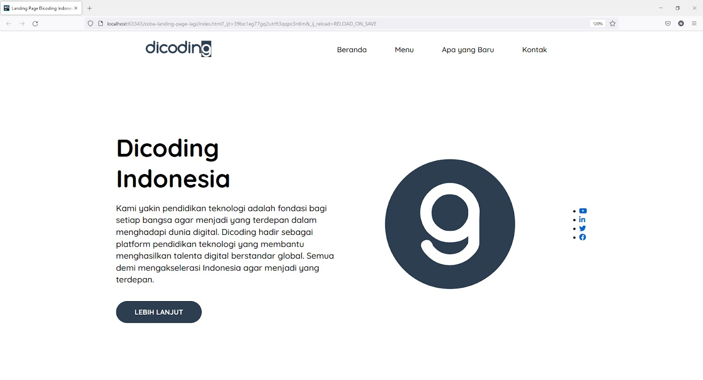

# Pengenalan Latihan: Landing Page Dicoding Indonesia
Anda sudah mengetahui dan memahami materi flexible box layout hingga menerapkannya pada website. Sekarang mari kita terapkan flexbox ini secara lebih lanjut pada website landing page Dicoding Indonesia.

Sebagai gambaran, website landing page yang akan kita bangun bisa Anda perhatikan pada gambar berikut.

Sudah tidak sabar, kan? Yuk, kita mulai masuk ke materi selanjutnya.

# Latihan: Landing Page Dicoding Indonesia
Di sini kita akan berlatih lebih lanjut dalam penggunaan Flexible Box Layout dengan membangun website Landing Page Dicoding Indonesia.

1. Pertama-tama, buatlah direktori proyek yang akan kita gunakan. Untuknya, Anda cukup membuat folder atau direktori baru dengan nama LandingPageDicodingIndonesia sebagai root proyek.

2. Buatlah berkas index.html untuk menuliskan dokumen HTML kita. Selain itu, buat juga berkas app.css yang ditempatkan pada direktori css.

3. Sebelum kita melangkah lebih jauh, tentu kita akan memerlukan beberapa aset gambar untuk website ini. Silakan Anda unduh melalui tautan ini serta ekstrak berkas zip tersebut pada direktori root proyek.

4. Berikut adalah detail dari struktur folder proyek kita.

5. Pada berkas index.html, silakan Anda tuliskan struktur dasar dokumen HTML berikut ini.

<!DOCTYPE html>
<html lang="en">
  <head>
    <meta charset="UTF-8">
    <title>Landing Page Dicoding Indonesia</title>
 
    <!-- CSS Utama -->
    <link rel="stylesheet" href="css/app.css">
  </head>
  <body></body>
</html>

Jika kita lihat kode HTML di atas, berkas CSS External telah dihubungkan sehingga kita siap menuliskan kode CSS padanya.

6. Langkah awal yang akan kita lakukan adalah membuat navigasi bar. Navigasi ini terdiri dari logo Dicoding dan empat buah tautan navigasi. Navigasi bar ini akan kita bungkus menggunakan tag header. Silakan tuliskan kode di bawah ini pada tag <body>.

<header class="navbar-container">
 

   
 

 <nav class="nav-list">
   <ul>
     <li><a href="#">Beranda</a></li>
     <li><a href="#">Menu</a></li>
     <li><a href="#">Apa yang Baru</a></li>
     <li><a href="#">Kontak</a></li>
   </ul>
 </nav>
</header>

Jika kita jalankan melalui browser, tampilannya akan menjadi seperti ini.

7. Berikutnya, kita akan memberikan styling setiap setelah menuliskan struktur elemen HTML. Sebelum kita melangkah lebih lanjut, kita perlu menambahkan beberapa hal terlebih dahulu pada berkas app.css. Di sini kita akan menambahkan gaya font dari Google Font. Untuk itu, silakan Anda buka tautan Google Font. 

8. Kemudian, Anda ketik pada kolom pencarian “Quicksand”. Jika sudah, Anda akan disuguhkan satu font family bernama Quicksand.

9. Di halaman ini, kita akan ditawarkan font dengan beberapa ketebalannya. Di sini kita akan memilih dua gaya ketebalan font, yaitu 500 dan 700. Silakan klik tombol “Select this style”.

10. Jika sudah, kedua font tersebut pun akan terpilih. Lalu, akan muncul pada menu “Selected Family” dari sebelah kanan.

11. Silakan Anda klik radio button yang bertuliskan “@import”, lantas salin kode yang muncul dan tempelkan pada berkas app.css.

  @import url('https://fonts.googleapis.com/css2?family=Quicksand:wght@500;700&display=swap');

  Selanjutnya, kita akan menambahkan beberapa properti CSS pada elemen <body> dan seluruh elemen yang ada. Seluruh elemen akan kita terapkan properti box-sizing: border-boxagar element-element tersebut dapat memiliki ukuran dimensi yang sama meskipun memiliki ukuran padding, margin, dan border. Tambahkan kode berikut pada app.css.

12. Sementara itu, pada elemen <body>akan kita ubah ukuran margin menjadi 0 (nol), font family menggunakan Quicksand, dan minimal tinggi halaman adalah satu viewport. Silakan tulis kode berikut pada berkas app.css.

body {
 height: 100vh;
 font-family: 'Quicksand', sans-serif;
 margin: 0;
 
 display: flex;
 flex-direction: column;
}

13. Pada struktur navigasi yang telah kita tuliskan sebelumnya, mari kita berikan styling untuknya. Silakan Anda tambahkan kode berikut ini.

header.navbar-container {
 max-width: 1200px;
 width: 100%;
 margin-inline: auto;
 display: flex;
 justify-content: space-around;
 align-items: center;
 
 padding-block: 1rem;
 z-index: 999;
}
 
header.navbar-container .logo img {
 width: 150px;
}

Pada kode CSS di atas, kita telah menerapkan flexbox pada navbar container sehingga logo Dicoding dan tautan navigasi dapat tersusun secara fleksibel menggunakan properti justify-content: space-around. Properti dengan value ini akan membuat logo dan nav link berada di tepi container pada main axis. Selain itu, kita juga menerapkan z-index agar navbar selalu berada pada lapisan teratas sehingga user senantiasa dapat meraihnya. 

14. Kemudian, kita akan membuat tautan navigasi menggunakan flexbox. Tambahkan kode berikut ini.
header.navbar-container .nav-list ul {
  padding-left: 0;
  display: flex;
  justify-content: center;
  gap: 2rem 1rem;
}
 
header.navbar-container .nav-list li {
  list-style-type: none;
}
 
header.navbar-container .nav-list li a {
  text-decoration: none;
  font-size: 1.05rem;
  font-weight: 500;
  color: black;
  padding: .5rem 1.5rem;
  border-radius: 999px;
  transition: all .2s ease-in-out;
}
 
header.navbar-container .nav-list li:hover a {
  background-color: #425c77;
  color: white;
}

Pada kumpulan tautan navigasi, kita membuat flex container pada elemen ul di dalam elemen div.nav-list sehingga seluruh elemen li menjadi flex-items.

15. Keseluruhan kode akan menjadi seperti berikut.
@import url('https://fonts.googleapis.com/css2?family=Quicksand:wght@400;500;700&display=swap');
 
*, *::before, *::after {
  box-sizing: border-box;
}
 
body {
  height: 100vh;
  font-family: 'Quicksand', sans-serif;
  margin: 0;
 
  display: flex;
  flex-direction: column;
}
 
header.navbar-container {
  max-width: 1200px;
  width: 100%;
  margin-inline: auto;
  display: flex;
  justify-content: space-around;
  align-items: center;
 
  padding-block: 1rem;
  z-index: 999;
}
 
header.navbar-container .logo img {
  width: 150px;
}
 
header.navbar-container .nav-list ul {
  padding-left: 0;
  display: flex;
  justify-content: center;
  gap: 2rem 1rem;
}
 
header.navbar-container .nav-list li {
  list-style-type: none;
}
 
header.navbar-container .nav-list li a {
  text-decoration: none;
  font-size: 1.05rem;
  font-weight: 500;
  color: black;
  padding: .5rem 1.5rem;
  border-radius: 999px;
  transition: all .2s ease-in-out;
}
 
header.navbar-container .nav-list li:hover a {
  background-color: #425c77;
  color: white;
}

16. Selanjutnya, kita akan membuat konten utama dari landing page ini. Mari kita tuliskan struktur HTML seperti berikut.

<main>
 

   

     <h1 class="title">Dicoding Indonesia</h1>
     
Kami yakin pendidikan teknologi adalah fondasi bagi setiap bangsa agar menjadi yang terdepan dalam menghadapi dunia digital. Dicoding hadir sebagai platform pendidikan teknologi yang membantu menghasilkan talenta digital berstandar global. Semua demi mengakselerasi Indonesia agar menjadi yang terdepan.

     <button>Lebih lanjut</button>
   

   

     
   

 

 <aside>
   

     <ul>
       <li><a href="#"><i class="fab fa-youtube"></i></a></li>
       <li><a href="#"><i class="fab fa-linkedin-in"></i></a></li>
       <li><a href="#"><i class="fab fa-twitter"></i></a></li>
       <li><a href="#"><i class="fab fa-facebook"></i></a></li>
     </ul>
   

 </aside>
</main>

17. Itu sebabnya kita akan menggunakan library font-awesome melalui CDN (Content Delivery Network) yang akan kita sematkan pada dokumen HTML agar ikon tersebut dapat tampil. Silakan buka tautan berikut ini (https://cdnjs.com/libraries/font-awesome/5.15.4). Kemudian, lakukan copy pada URL CDN yang paling awal dan paste-kan pada tag head di bawah tag link css.

  <title>Latihan Flexbox</title>
 
  <!-- CSS Utama -->
  <link rel="stylesheet" href="css/app.css">
 
  <!-- Font Awesome 5.15.4 -->
  <link rel="stylesheet" href="https://cdnjs.cloudflare.com/ajax/libs/font-awesome/5.15.4/css/all.min.css" integrity="sha512-1ycn6IcaQQ40/MKBW2W4Rhis/DbILU74C1vSrLJxCq57o941Ym01SwNsOMqvEBFlcgUa6xLiPY/NS5R+E6ztJQ==" crossorigin="anonymous" referrerpolicy="no-referrer"/>
</head>
<body>

18. Jika halaman website kita lakukan refresh, ikon-ikon media sosial dapat muncul seperti di bawah ini.

19. Bila sudah berhasil, selanjutnya kita akan memberikan styling untuk konten utama. Silakan Anda tambahkan kode CSS pada app.css berikut ini.

Di sini kita menerapkan flexbox pada elemen main agar konten utama website dapat diposisikan berada di tengah secara vertikal menggunakan align-items. Sementara itu, untuk elemen aside, kita berikan position: fixed agar media sosial dapat diletakkan pada tepi viewport sehingga elemen tersebut keluar dari normal-flow. Ini akan membuat elemen <main> hanya memiliki satu flex-items, yaitu div.content. Jika kita jalankan melalui browser, hasilnya akan seperti di bawah ini.

20. Kemudian, pada elemen div.content akan kita jadikan sebagai flex container. Tujuannya adalah kita akan membuat deskripsi tulisan dan gambar logo dalam posisi berdampingan membentuk dua kolom. Sebelumnya kita menggunakan properti float, tetapi dengan flexbox kita akan lebih mudah untuk mencapainya. Silakan tuliskan kode CSS berikut ini pada app.css.

main .content {
  flex: 1;
  display: flex;
  align-items: center;
}
 
main .content .content-description {
  flex: 1 1;
}
 
main .content .content-description .title {
  font-size: 3.5rem;
  margin-block: 1rem;
}
 
main .content .content-description p {
  line-height: 1.7rem;
  font-size: 1.2rem;
}
 
main .content .content-description button {
  padding: .8rem 2.5rem;
  margin-block-start: 1rem;
  text-transform: uppercase;
  font-weight: 700;
  font-size: 1rem;
  font-family: 'Quicksand', sans-serif;
  color: white;
 
  border: 3px solid transparent;
  border-radius: 999px;
  background-color: #2D3E50;
  cursor: pointer;
  transition: all .15s ease-in;
}
 
main .content .content-description button:hover {
  border: 3px solid #2D3E50;
  color: #2D3E50;
  background-color: transparent;
}
 
main .content .content-image {
  flex: 1;
  display: flex;
}
 
main .content .content-image img {
  margin: auto;
  min-width: 250px;
  width: 300px;
}

Secara default atau bawaan, ketika flexbox didefinisikan maka seluruh flex-items akan dijejerkan secara horizontal. Di sini kita tidak perlu memberikan properti flex-direction karena value default darinya adalah row atau baris (horizontal). Selain itu, kita juga menerapkan properti flex-grow dengan value 1 pada masing-masing flex-items. Akan tetapi, untuk menerapkan properti tersebut, kita akan menggunakan properti shorthand sebagai cara lain, yaitu flex. Jika lupa tentangnya, silakan Anda buka materi "Properti-Properti pada Flex Items" untuk mengulasnya kembali.

Jika diperhatikan pada elemen gambar, kita sama sekali tidak menerapkan align-items atau justify-content agar gambar berada di tengah-tengah kontainer. Mengapa hal tersebut bisa terjadi? Triknya adalah kita jadikan elemen 
 (pembungkus dari element gambar) sebagai flex container dengan menerapkan properti display: flex. Kemudian, kita terapkan properti margin: auto pada elemen  sehingga gambar berada di tengah kontainer. Ini akan memberikan nilai margin di semua sisi, baik secara vertikal maupun horizontal. Untuk memperjelasnya, Anda dapat simak lebih lanjut dengan melihat pada contoh kasus pada https://codesandbox.io/s/contoh-margin-auto-dalam-flexbox-kd4elo. https://codesandbox.io/s/contoh-margin-auto-dalam-flexbox-kd4elo

21. Selanjutnya, kita akan mengatur tampilan ikon media sosial. Kita akan memosisikannya pada tepi viewport (menempel). Strateginya, kita akan terapkan properti position: fixed pada element <aside>. Sama seperti sebelumnya, kita akan menengahkan elemen <ul> secara vertikal pada elemen-elemen div.social-media menggunakan margin: auto. Selain itu, elemen <ul> juga diberikan properti display: flex untuk menjejerkan elemen <li> secara vertikal. Untuk lebih jelasnya, silakan Anda tuliskan kode CSS sebagai berikut.

main aside {
  position: fixed;
  inset-block: 0;
  inset-inline-end: 0;
}
 
main aside .social-media {
  height: 100%;
  display: flex;
}
 
main aside .social-media ul {
  padding: 1.5rem 1rem;
  margin: auto;
  border-top-left-radius: 12px;
  border-bottom-left-radius: 12px;
  background-color: #2D3E50;
 
  display: flex;
  flex-flow: column nowrap;
  align-items: center;
  justify-content: center;
  gap: 1.5rem;
}
 
main aside .social-media li {
  list-style-type: none;
}

Jika dilihat pada kode di atas, kita menemukan properti inset. Properti tersebut memiliki fungsi yang sama dengan properti top, right, bottom, dan left ketika menerapkan properti position. Dengan kata lain, properti inset merupakan sebuah properti shorthand untuk ke-empat properti tersebut. Sementara itu, untuk nama tambahan di depannya seperti inset-block dan inset-inline, itu artinya inset-block akan memberikan nilai pada posisi vertikal (top dan bottom), sedangkan inset-inline akan memberikan nilai pada posisi horizontal (left dan right). Jika kita jalankan, hasilnya adalah seperti berikut.

22. Kemudian, supaya gambar ikon dapat terlihat lebih cantik, mari kita tambahkan beberapa kode CSS berikut.

main aside .social-media li a {
  text-decoration: none;
  font-size: 1.5rem;
  color: white;
  transition: all .1s ease-in-out;
}
 
main aside .social-media li a:hover {
  color: #89b0d9;
}