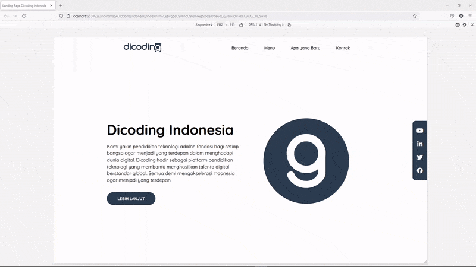
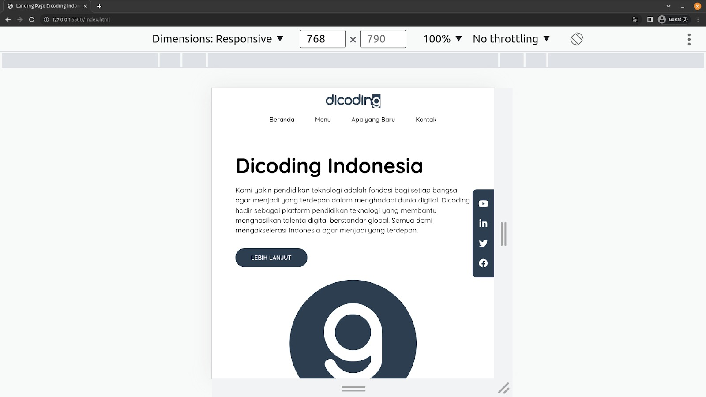
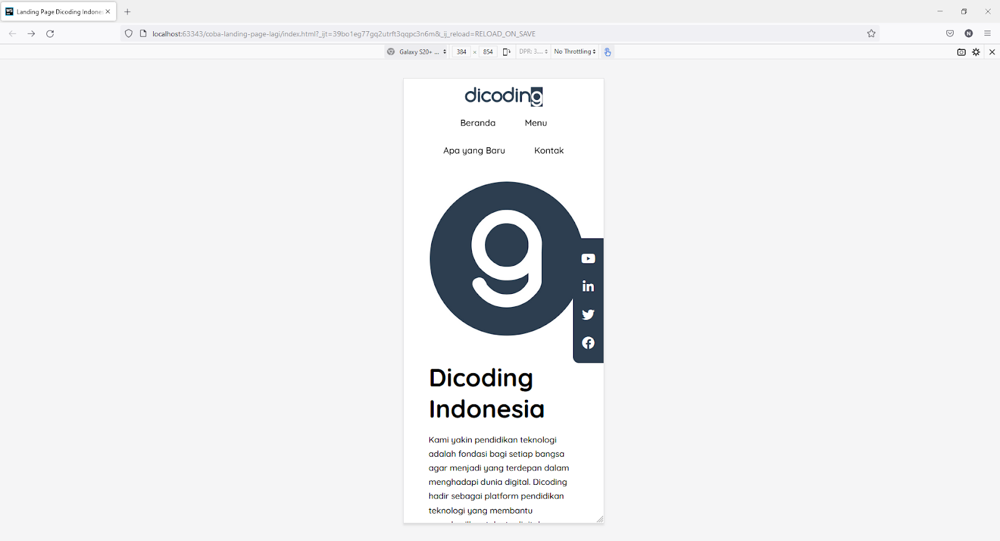

# Membangun Layout Responsif pada Landing Page
Pada latihan sebelumnya, kita telah mengembangkan website Landing Page Dicoding Indonesia. Namun, website tersebut masih belum memiliki responsibilitas yang baik pada ukuran layar kecil (smartphone). Oleh karena itu, mari kita perbaiki website tersebut dengan menambahkan media query pada berkas app.css.

1. unduh jika file belom ada
2. Untuk menerapkan responsibilitas, kita perlu menambahkan tag <meta> dengan atribut name=”viewport” untuk mengenali ukuran smartphone device. Silakan Anda buka berkas index.html dan tambahkan tag <meta> berikut ini di dalam tag <head> sebelum tag <title>.

 <head>
    <meta charset="UTF-8" /> 
    <!-- yang d tambahakan di bawah ini -->
    <meta name="viewport" content="width=device-width, initial-scale=1.0">
 
    <title>Landing Page Dicoding Indonesia</title>
 
    <!-- Kode lainnya disembunyikan -->
  </head>

  3. Jika sudah, kita bisa mulai memperbaiki layout di layar yang kecil. Silakan buka berkas app.css dan tambahkan kode media query yang bercetak tebal berikut.
  /* Medium devices (landscape tablets, 768px and down) */
@media screen and (max-width: 768px) {}

Kita akan menambahkan beberapa properti yang diperlukan agar browser dapat menerapkan CSS sesuai ukuran layar yang ditentukan pada media query di atas.

4. Hal pertama yang perlu kita sesuaikan adalah navbar container. Tampilan dari navbar pada ukuran desktop
atau laptop sudah baik, tetapi bila kita lihat pada ukuran kecil akan terjadi overflow atau teks dari tautan navigasi menjadi turun. Oleh karena itu, kita perlu mengubah value dari properti flex-direction menjadi column. Tambahkan properti tersebut pada navbar container sebagai berikut.

@media screen and (max-width: 768px) {
  header.navbar-container {
    flex-direction: column;
  }
}

5. Jika kita perhatikan, kita telah berhasil mengubah flex-direction menjadi column. Namun, jika kita kecilkan lagi ukuran layarnya di bawah 462px, terdapat konten dari tautan navigasi yang turun.

Oleh karena itu, kita perlu menerapkan properti flex-wrap: wrap pada elemen <ul>. Silakan tambahkan kode CSS berikut ini.

 header.navbar-container .nav-list ul {
    flex-wrap: wrap;
    column-gap: .5rem;
  }

6. Selanjutnya, kita akan memperbaiki konten utama. Di sini kasus yang terjadi adalah sama dengan sebelumnya, yaitu terjadi overflow jika ditampilkan pada viewport dengan ukuran width yang kecil. Oleh karena itu, kita tambahkan properti flex-direction: column pada elemen main .content sebagai berikut.

  main .content {
    flex-direction: column;
    gap: 2rem;
  }

  Jika proyek kembali dijalankan, tampilan halaman pada breakpoint di bawah 768 pixel akan tampak seperti berikut.

  

  7. Kemudian, kita juga akan mengubah beberapa hal seperti padding, font-size, dan order. Hal ini dikarenaan tampilan di desktop tidak sesuai jika ditampilkan di layar kecil. Tambahkan kode berikut.

  main .content .content-description .title {
    font-size: 3rem;
  }
 
  main .content .content-description p {
    font-size: 1rem;
  }
 
  main .content .content-image {
    order: -1;
  }

  Jika dilihat, kita menerapkan properti order pada elemen div.content-image. Fungsi dari properti ini adalah mengatur urutan peletakkan dari susunan flex-items. Secara default, valuenya adalah 0. Namun, jika kita berikan -1, flex-item yang bersangkutan akan ditempatkan pada urutan awal. Bila proyek dijalankan melalui browser, tampilannya akan terlihat seperti berikut.

  

  8. Saat ini, keseluruhan kode akan menjadi seperti berikut.

9. finish