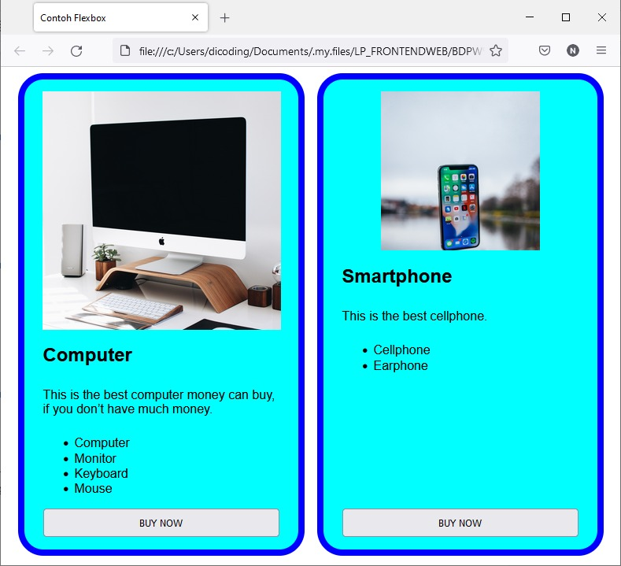
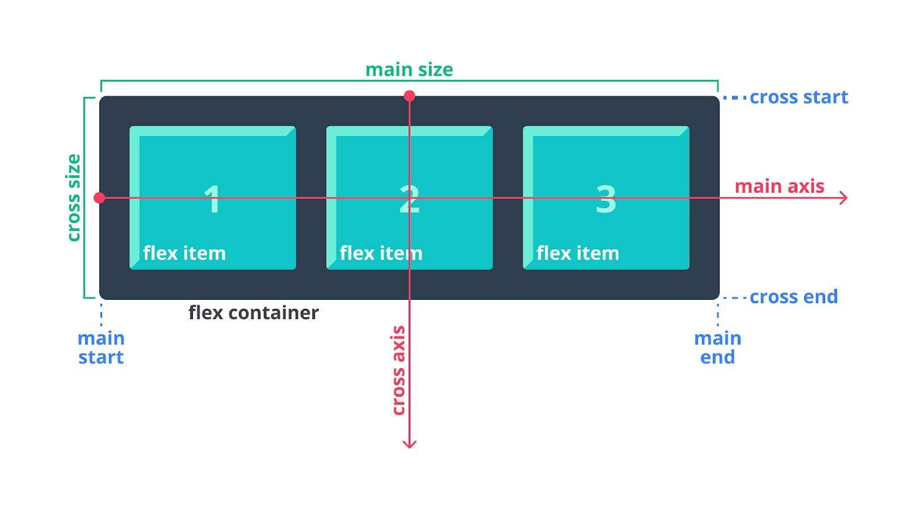

Rangkuman Layout Responsif dengan Flexbox
Kita telah belajar banyak hal dalam modul Layout Responsif dengan Flexbox. Kami siapkan rangkuman materi terhadap hal yang telah Anda pelajari selama ini. Harapannya, Anda dapat mengingat kembali setiap materi yang disampaikan.

Pengantar Flexbox
Flexbox atau Flexible Box Layout adalah model layout satu dimensi guna menyusun elemen-elemen (flex items) dalam posisi baris (row) atau kolom (column). Hal ini membuat flexbox disebut direction-agnostic. 

Hal menarik dari flexbox adalah ia menawarkan penyusunan layout dengan fleksibel karena flex container mengatur dimensi setiap flex-items (child element) sehingga layout yang diinginkan dapat tercapai dengan mudah. Flex container memperluas flex items untuk mengisi ruang kosong atau menciutkannya sehingga menghindari overflow (dimensi child element yang keluar dari parent element-nya).

Dengan hadirnya flexbox, perancangan layout dalam skala yang kecil dapat dilakukan dengan mudah dalam halaman web.

Alasan Flexbox Hadir
Sebelum hadirnya flexbox, satu-satunya cara untuk membuat layout halaman web adalah float dan positioning. Namun, dalam beberapa kasus, penggunaan kedua properti CSS ini terbatas dan menyulitkan.

Membuat konten berada di tengah secara vertikal dalam parent element-nya.
Membuat semua child element memenuhi ruang dari parent element-nya secara dinamis dan merata.
Membentuk child-element dalam layout multiple-column memiliki ukuran height yang sama, meskipun jumlah content di dalamnya tidak sama.
Dari beberapa kasus di atas, layouting pada website akan sulit dijangkau oleh float dan positioning. Di sinilah flexbox hadir untuk menyelesaikan masalah seperti di atas.

Dasar-Dasar dan Terminologi Flexbox

Pada gambar di atas, terlihat bahwa ada dua istilah khusus pada elemen yang menerapkan flexbox, yaitu flex container dan flex item. Flex container adalah parent elemen dari seluruh flex items, sedangkan flex items adalah elemen yang secara langsung merupakan child dari parent element.

Selain itu, ada beberapa istilah lain dalam flexbox. Berikut penjelasannya.

Main axis: main axis dari flex container adalah arah sumbu utama yang mana flex items akan dijejerkan atau ditata. Perlu diingat, arah dari main axis tidak selalu horizontal. Hal ini bergantung terhadap value dari properti flex-direction.
Main-start | main-end: flex items akan ditempatkan dalam flex container yang berawal dari main-start dan main-end.
Main size: main size merupakan lebar atau tinggi dari flex item yang diposisikan pada sumbu utama (main axis).
Cross axis: cross axis adalah sumbu yang arahnya tegak lurus dengan main axis. Biasanya ini terjadi ketika flexbox menerapkan value wrap pada properti flex-wrap sehingga susunan layout terlihat dua dimensi.
Cross-start | cross-end: flex item yang memenuhi ruang kosong flex container secara vertikal, dimulai dari cross-start hingga cross end. Hal ini dapat kita atur menggunakan properti align-items, align-self, dan align-content.
Cross size: lebar atau tinggi dari sebuah flex item yang ditempatkan pada dimensi cross.

Properti-Properti pada Flex Container
Dalam penerapan flexbox, ada properti-properti yang terlibat pada dua hal, yaitu flex container (parent element) dan flex items. Properti-properti pada flex container akan berpengaruh secara langsung kepada flex items dalam menampilkan susunannya. Berikut daftar dan penjelasannya.

display: mendefinisikan elemen agar disusun sebagai flexible box.
flex-direction: menentukan arah susunan flex items dijajarkan.
flex-wrap: mengubah perilaku susunan flex items menjadi dua dimensi (jika dibutuhkan).
justify-content: mengatur tata letak dari flex items pada main axis.
align-items: mirip seperti justify-content, tetapi mengatur child element dalam satu baris pada cross axis.
align-content: melakukan perataan terhadap flex items di setiap baris pada cross-axis.
gap: memberikan jarak atau celah pada flex items.

Properti-Properti pada Flex Items
Setelah mempelajari properti-properti pendukung pada flex container, kita akan membahas properti-properti yang digunakan pada flex items. Ingat! Properti yang ditujukan pada flex items hanya akan berpengaruh pada flex item yang di target, bukan elemen pembungkusnya (flex container).

order: mengatur urutan susunan flex items.
flex-grow: melakukan grow (pelebaran ukuran) dari flex items yang ditarget pada main axis.
flex-shrink: menyusutkan atau menciutkan ukuran child element jika ukurannya tidak mencukupi ruang container.
flex-basis: memberikan ukuran default sebelum sisa ruang container didistribusikan kepada flex items.
align-self: mengatur posisi child element secara cross-axis.