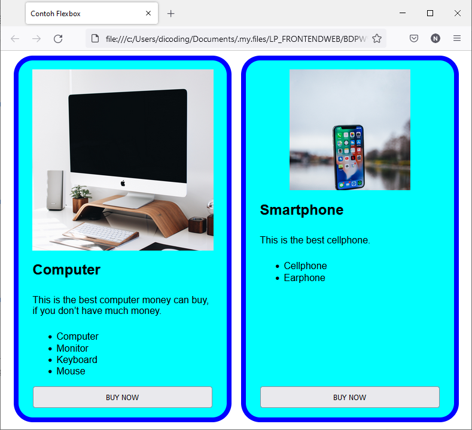

# Alasan Flexbox Hadir
Sebelum hadirnya flexbox, satu-satunya cara untuk membuat layout halaman web adalah float dan positioning. Dengan menggunakan kedua properti CSS tersebut, kita sudah bisa membuat layout yang kita inginkan, baik di layar desktop maupun mobile. Namun, dalam beberapa kasus, penggunaan kedua properti CSS ini terbatas dan menyulitkan.

Beberapa contoh kasus yang mungkin menyulitkan dan tidak fleksibel untuk dicapai dari penggunaan float dan positioning:

* Membuat konten berada di tengah secara vertikal dalam parent element-nya. Dari beberapa kasus, hal ini bisa dicapai menggunakan line-height. Namun, ini hanya berguna jika konten berada dalam satu baris serta kita harus mengetahui secara eksplisit tinggi dari parent element.

* Membuat semua child element memenuhi ruang dari parent element-nya secara dinamis dan merata. Hal ini mungkin bisa tercapai menggunakan ukuran nilai persentase. Namun, jika jumlah child element berjumlah ganjil, kita harus memikirkan nilai persentase yang tepat. Bahkan, tetap akan meninggalkan celah ruang sedikit (tidak penuh).

* Membentuk child element dalam layout multiple-column memiliki ukuran height yang sama, meskipun jumlah content di dalamnya tidak sama.

Dari beberapa kasus tersebut, akan sulit dijangkau oleh float dan positioning. Di sinilah flexbox hadir untuk menyelesaikan masalah seperti di atas.

Sebagai gambaran, mari kita perhatikan contoh kasus pada tampilan halaman web berikut ini.

Anda bisa menyimak contoh kasus flexbox di atas dengan membuka tautan ini atau melihat hasilnya pada tautan ini (https://5we5i3.csb.app/).

Contoh pembuatan layout katalog di atas disusun menggunakan flexbox sehingga posisi gambar berada di tengah, ukuran card menjadi responsif meski viewport berubah, dan ukuran height menjadi sama. Jika kita perhatikan gambar di atas, flexbox melibatkan banyak properti pendukung sehingga susunan layout disusun sedemikian rupa sesuai kebutuhan kita. Kita akan membahas properti-properti pendukung ini pada submodul berikutnya.

Bagaimana, terlihat mudah dan menyenangkan, bukan? Mari kita mulai belajar mengenai flexbox. Lanjut!

