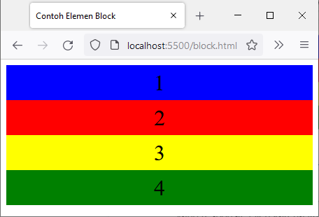

# Pengenalan Flexbox
Sebagaimana nama dari modul ini, kita akan membahas layout baru yang didefinisikan pada properti display, yaitu flexbox. Pada modul pendalaman CSS, kita telah mempelajari dua tipe elemen HTML atau dua mode layout: block dan inline. Tipe elemen block didesain untuk membuat layout dokumen karena tipe ini akan mengatur penataan secara vertikal (atas dan bawah) dan menambahkan baris baru. Sementara itu, tipe elemen inline didesain untuk membuat layout teks karena tipe ini mengatur penataan secara horizontal (kiri dan kanan). 

Selain itu, dalam membuat layout, kita telah mempelajari properti float untuk membuat multiple column. Namun, penggunaan properti ini dirasa sulit dan tidak efektif untuk membuat website yang responsif. Oleh karena itu, kita akan membahas permasalahan ini secara lebih lengkap pada submodul berikutnya. Kali ini kita akan mengenal dan memahami Flexbox atau Flexible Box Layout.

Flexible Box Layout adalah model layout satu dimensi guna menyusun elemen-elemen (flex items) dalam posisi rows atau columns. Hal ini membuat flexbox disebut dengan direction-agnostic. Hal menarik dari flexbox adalah ia menawarkan penyusunan layout dengan fleksibel karena flex container mengatur dimensi setiap flex-items (child element) sehingga layout yang diinginkan dapat tercapai dengan mudah. Flex container memperluas flex items untuk mengisi ruang kosong atau menciutkannya sehingga menghindari overflow (dimensi child element yang keluar dari parent element-nya). Dengan hadirnya flexbox, perancangan layout dalam skala yang kecil dapat dilakukan dengan mudah dalam halaman web.

Apakah Anda penasaran cara kerja flexbox ini? Sabar, kita akan mempelajari terlebih dahulu mengapa flexbox ini dapat mempermudah penyusunan layout. Let’s go!
