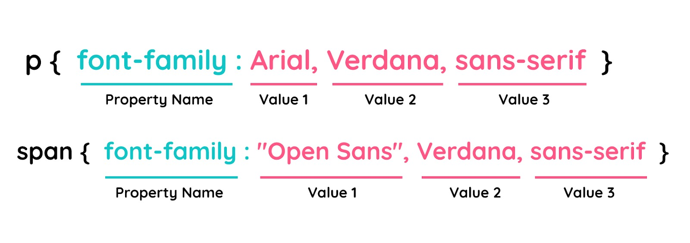

# Font-family
Pada modul pengenalan CSS, kita sudah mencoba menggunakan font properties ini untuk mengubah standar font yang ditampilkan pada browser dengan menggunakan font-family pada elemen body.

Pada rule tersebut, kita mengubah standar font yang digunakan browser dengan font ‘sans-serif’. Sebenarnya untuk nilai dari properti ini dapat lebih dari satu (dikenal sebagai font stack), tujuannya adalah sebagai fallback jika terjadi kegagalan dalam menggunakan font yang kita gunakan.

<!DOCTYPE html>
<html>
  <head>
    <meta charset="UTF-8" />
    <title>Judul Dokumen</title>
    
    <link rel="stylesheet" href="style.css" />
  </head>
  <body>
    <header>
      

        <h1>Bandung</h1>
        

          Kota metropolitan terbesar di Provinsi Jawa Barat, sekaligus menjadi ibu kota provinsi
          tersebut.
        

      

      <nav>
        <ul>
          <li><a href="#">Sejarah</a></li>
          <li><a href="#">Geografis</a></li>
          <li><a href="#">Wisata</a></li>
        </ul>
      </nav>
    </header>
  </body>
</html>

body {
  font-family: sans-serif;
}

Untuk menuliskan lebih dari satu nilai font, berikut adalah aturan yang harus kita perhatikan.

Penjelasannya sebagai berikut.

* Seluruh nilai font yang bukan merupakan generic font families harus dituliskan secara kapital. Contohnya, “Arial” bukan dituliskan “arial”.
* Gunakan tanda koma (,) untuk memisahkan antara nilai font yang digunakan. 
* Selalu tanda kutip (“) untuk membungkus nilai font yang memiliki spasi pada namanya. Contohnya “Open Sans”.

Mungkin kita bertanya-tanya mengapa perlu memberikan lebih dari satu nilai pada font-family? Hal tersebut penting karena tidak semua browser mendukung semua jenis font. Jadi, menambahkan lebih dari satu nilai font dapat memberikan alternatif pada browser dalam menampilkan font jika font utama yang diterapkan tidak didukung oleh browser. 

Bagaimana urutan prioritasnya? Dimulai dari jenis font yang pertama dituliskan. Jika font pertama didukung oleh browser, ia akan digunakan. Jika tidak, lantas browser akan memeriksa nilai font yang kedua dan menggunakannya apabila didukung, begitupun selanjutnya.

Hal yang perlu kita perhatikan adalah pastikan untuk menggunakan generic font families pada akhir nilai properti font-family. Nilai ini dipastikan didukung oleh seluruh browser saat ini. Lantas, apa saja nilai dari generic font families ini? Berikut adalah nilai-nilai generic font families yang dapat kita gunakan untuk fallback mechanism.

* Serif: jenis font yang memiliki runcing pada garis akhir karakternya. Times New Roman merupakan salah satu jenis serif font.
* Sans-serif: jenis font yang tidak meruncing pada garis akhir karakternya. Contohnya, “Open Sans”, “Fira Sans” dan lainnya.
* Monospace: jenis font yang memiliki nilai lebar tiap karakternya sama. Consolas merupakan salah satu jenisnya.
* Cursive: jenis font yang tampak seperti handwriting atau hasil tulisan tangan.
* Fantasy: jenis font yang merepresentasikan karakteristik yang menyenangkan.
* System-ui: jika menerapkan nilai ini maka font yang diterapkan akan sama seperti font yang digunakan pada sistem operasi kita.
* Math: jenis font yang digunakan untuk penulisan rumus-rumus matematika.
* Emoji: jenis font yang digunakan untuk menampilkan emoji.
* Fangsong: jenis font yang menampilkan gaya penulisan Chinese.