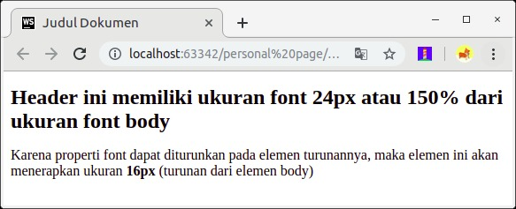

# Font-size
Mengubah nilai font pada sebuah dokumen adalah hal yang sangat wajar terjadi, begitu pula pada website. Untuk menetapkan ukuran font, kita perlu menerapkan properti font-size dengan menetapkan nilai dari properti ini dengan menuliskan langsung nilai dan satuannya.

Contohnya berikut.

h1 {
  font-size: 1.5em;
}

<!DOCTYPE html>
<html>
  <head>
    <meta charset="UTF-8" />
    <title>Judul Dokumen</title>
    
    <link rel="stylesheet" href="style.css" />
  </head>
  <body>
    <h1>Bandung</h1>
  </body>
</html>

Hal yang perlu kita perhatikan adalah ketika menuliskan nilai dan satuannya. Pastikan tidak ada jarak (spasi) di antaranya
 
 /* Rule tidak akan diterapkan pada target karena kesalahan penulisan nilai properti */
h1 {
  font-size: 1.5 em;
}

Satuan dalam menetapkan ukuran font terbagi dua jenis.

* Relative Unit
Satuan yang nilainya tergantung pada suatu hal. Contohnya, ukuran viewport, induk elemen, atau ukuran teks standar.
* Absolute Unit
Satuan yang nilainya telah ditentukan atau digunakan dalam dunia nyata.

Berikut adalah daftar satuan yang dapat kita manfaatkan dalam menetapkan ukuran font beserta fungsinya.

Relative Unit

Absolute Unit

Selain dengan menetapkan nilai dan satuannya secara langsung, kita juga bisa menggunakan nilai persentase untuk mengatur ukuran font.

body {
  font-size: 16px;
}
 
h1 {
  font-size: 150%; /* 150% dari 16 = 24px */
}

Pada contoh di atas, ukuran font dari elemen <h1> seharusnya memiliki ukuran 16px karena mewarisi dari induk elemennya (body). Namun, di bawahnya terdapat rule yang menargetkan secara spesifik untuk elemen h1 untuk menerapkan ukuran font sebesar 150% dari ukuran induknya. Dampaknya, elemen <h1> akan tampak 50% lebih besar dari elemen lain yang ada di dalam body.

Hal yang terakhir, kita juga bisa menentukan ukuran font dengan menuliskan kata kunci secara spesifik yang tersedia pada CSS. Kata kunci tersebut: xx-small, x-small, small, medium, large, x-large, dan xx-large.

Kata kunci di atas tidak ada kaitannya dengan pengukuran tertentu (bukan ukuran yang absolute), tetapi nilainya diubah secara konsisten satu sama lain.

Pada gambar di atas, kita bisa lihat bahwa standarnya browser menampilkan teks dengan nilai medium. Properti font-size dapat diaplikasikan ke seluruh elemen yang ada di HTML dan nilainya dapat diturunkan pada elemen turunannya.