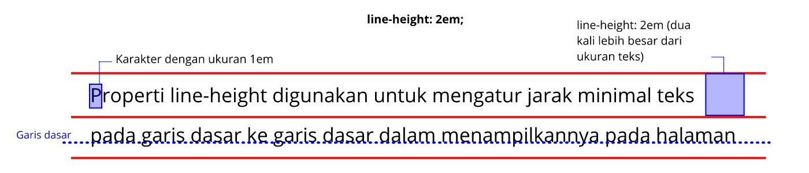

# Line Height
Properti line-height digunakan untuk mengatur jarak minimal dari garis dasar ke garis dasar dalam menampilkannya teks pada halaman. Jika kita terbiasa dengan software dokumen editor seperti Microsoft Word, properti ini mirip dengan fungsi line height.

Pada penjelasan di atas disebutkan “minimal” karena jika terdapat sebuah karakter yang tinggi atau besar dalam sebuah baris, tinggi dari baris pun akan menyesuaikan agar jarak tetap mengakomodasinya.

Berikut adalah contoh tiga cara berbeda dalam menerapkan tinggi baris dua kali lebih tinggi dari ukuran font.

<!DOCTYPE html>
<html>
  <head>
    <meta charset="UTF-8" />
    <title>Judul Dokumen</title>
    
    <link rel="stylesheet" href="styles.css" />
  </head>
  <body>
    

      Properti line-height digunakan untuk mengatur jarak minimal teks pada garis dasar ke garis
      dalam menampilkannya pada halaman web.
    

    

      Properti line-height digunakan untuk mengatur jarak minimal teks pada garis dasar ke garis
      dalam menampilkannya pada halaman web.
    

    

      Properti line-height digunakan untuk mengatur jarak minimal teks pada garis dasar ke garis
      dalam menampilkannya pada halaman web.
    

  </body>
</html>

.ln2 {
  line-height: 2;
}

.ln200 {
  line-height: 200%;
}

.ln2em {
  line-height: 2em;
}

Cara pertama merupakan cara yang paling mudah digunakan karena hanya menentukan nilai dengan satu angka. Konsepnya, angka tersebut nantinya dikalikan dengan nilai font-size sebelum diterapkan pada nilai properti line-height. Contohnya, ukuran font standar pada paragraf adalah 16 piksel dan kita definisikan properti line-height dengan nilai 2. Alhasil, seharusnya nilai properti line-height adalah 16 piksel * 2 = 32 piksel (dua kali lebih besar dari ukuran font).

Properti line-height dapat diaplikasikan ke seluruh elemen yang ada pada HTML dan nilainya dapat diturunkan pada elemen turunannya.