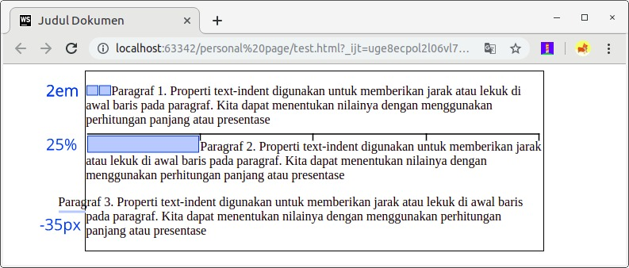

# Text Indent
Dalam membuat sebuah dokumen tidak jarang kita membutuhkan jarak/lekuk di awal paragraf, hal tersebut dapat dilakukan pada website dengan menerapkan properti text-indent.  Kita dapat menentukan nilai properti ini melalui perhitungan panjang dalam px, em, dan in atau bisa menggunakan nilai persentase (%). Nilai persentase dihitung berdasarkan lebar dari induk elemen. Berikut contoh penggunaannya.

Pada contoh ketiga kita bisa melihat bahwa pada nilai properti ini dapat diberikan nilai negatif. Jika kita menggunakannya, baris pertama pada paragraf akan keluar dari batas elemen yang menampungnya (biasa disebut hanging indent).

Perlu diingat kembali, properti ini hanya berpengaruh pada awal baris paragraf. Jika kita ingin menetapkannya untuk seluruh baris kita dapat gunakan margin atau padding, keduanya akan dibahas pada materi box model.

