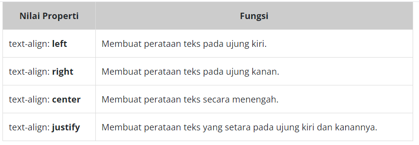

# Text Alignment
Kita bisa mengatur text alignment pada website seperti kita melakukannya pada aplikasi Microsoft Word dengan menggunakan properti text-align. Untuk standarnya, properti ini bernilai left atau biasa kita sebut rata kiri. Namun, standarnya bisa jadi menggunakan right atau rata kanan jika ada penerapan atribut language dengan nilai bahasa yang arah bacanya berlawanan. Contohnya Arab.

Berikut adalah nilai yang dapat digunakan pada properti text-align.

<!DOCTYPE html>
<html>
  <head>
    <meta charset="UTF-8" />
    <title>Judul Dokumen</title>
    
    <link rel="stylesheet" href="styles.css" />
  </head>
  <body>
    <main>
      

        text-align menetapkan peletakkan secara horizontal terhadap konten/elemen yang bersifat
        inline yang berada dalam elemen block.
      

      

        text-align menetapkan peletakkan secara horizontal terhadap konten/elemen yang bersifat
        inline yang berada dalam elemen block.
      

      

        text-align menetapkan peletakkan secara horizontal terhadap konten/elemen yang bersifat
        inline yang berada dalam elemen block.
      

      

        text-align menetapkan peletakkan secara horizontal terhadap konten/elemen yang bersifat
        inline yang berada dalam elemen block.
      

    </main>
  </body>
</html>

main {
  width: 80%;
  margin: 0 auto;

  border: 1px solid black;
}

p {
  border: 1px solid black;
}

.tl-left {
  text-align: left;
}

.tl-right {
  text-align: right;
}

.tl-center {
  text-align: center;
}

.tl-justify {
  text-align: justify;
}

