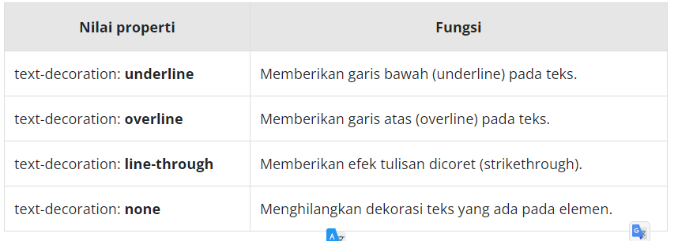

# Text Decoration
Properti ini paling populer digunakan ketika kita ingin membuat garis bawah atau underline pada teks. Namun, tidak hanya itu, ada beberapa nilai lain yang dapat kita gunakan untuk properti ini, detailnya sebagai berikut.

Dengan menggunakan text-decoration, kita dapat menghilangkan efek underline pada link yang ditampilkan dengan memberikan nilai text-decoration: none pada elemen <a>.

Silakan perhatikan contoh penerapannya berikut.

<!DOCTYPE html>
<html>
  <head>
    <meta charset="UTF-8" />
    <title>Judul Dokumen</title>
    
    <link rel="stylesheet" href="styles.css" />
  </head>
  <body>
    <main>
      

        <a href="#">Teks pada elemen anchor biasa</a>
      

      

        <a href="#" class="decoration-none">
          Teks pada elemen anchor biasa yang menerapkan text-decoration: none
        </a>
      

    </main>
  </body>
</html>
