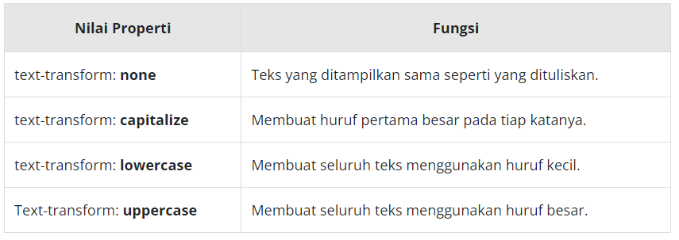

# Text Transform
Pasti kita pernah mencoba fitur pada document editor yang dapat mengubah kapitalisasi pada teks, fitur ini sangat membantu kala kita ingin mengubah kapitalisasi tanpa harus menuliskan kembali teksnya. Pada CSS juga terdapat fitur serupa, yaitu dengan menggunakan properti text-transform. Ketika kita menerapkan properti text-transform pada elemen teks, kapitalisasi akan berubah ketika halaman di-render tanpa harus mengubahnya pada dokumen HTML. 

Properti ini dapat berisikan nilai sebagai berikut.  

