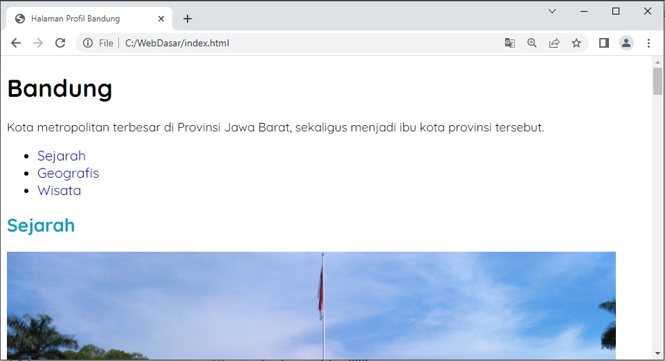

Pengantar Latihan: Menerapkan Font Styling pada Halaman Profil
Kita sudah mengenal banyak sekali properti yang dapat mengatur formatting text sejauh ini. Kita juga sudah mengetahui bahwa CSS memisahkan properti untuk font dan text. Nah, sekarang saatnya kita terapkan beberapa properti yang sudah kita pelajari pada Halaman Profil. 

Pada latihan kali ini, kita akan mengatur ukuran, ketebalan, dan posisi teks pada Halaman Profil. Selain itu, kita akan mengubah tipe font dari generic font families dengan memanfaatkan tipe font yang ditawarkan oleh Google Fonts. Menarik, bukan?

Sudah siap, kan? Yuk, masuk ke materi berikutnya!

Latihan: Menggunakan Font dari Google Fonts

Kita sudah belajar mengenai cara melakukan formatting teks pada halaman web. Tidak hanya itu, kita juga belajar cara memanipulasi teks, mulai dari tipenya, ukuran, ketebalan, style, dst. Mari kita terapkan ilmu-ilmu tersebut pada proyek studi kasus kita.

Tujuan
Pada materi font-family, kita belajar sedikit mengenai @font-face. Ia dapat digunakan untuk memperkaya gaya font untuk halaman web. Namun, kita tidak mempelajarinya secara dalam, kan? 

Nah, dalam rangka mengurangi rasa penasaran terhadap penerapan @font-face, kita akan menerapkannya, tetapi tidak secara manual. Kita akan menggunakan library font yang disediakan oleh Google pada Halaman Profil. Ia bernama Google Fonts. Dengannya, kita bisa mempelajari penerapan @font-face.

Hasil akhir dari latihan ini terlihat seperti berikut.

Alur Latihan
Berikut adalah alur latihan kali ini.

Membuka hasil latihan terakhir dengan VSCode.