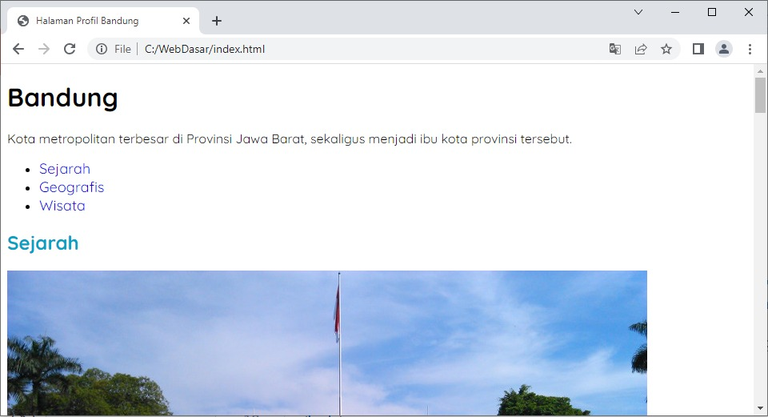
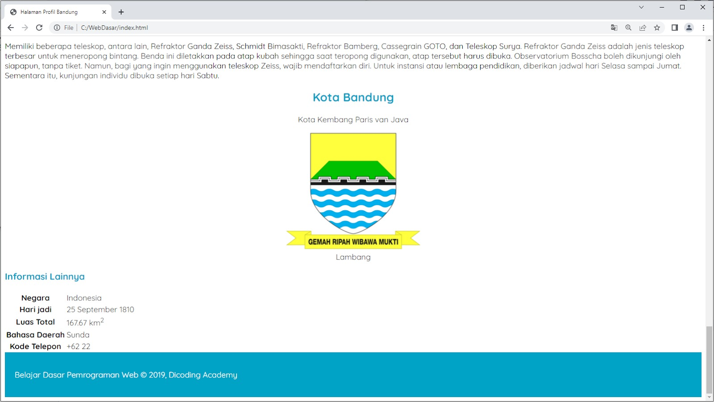

Latihan: Menetapkan Ukuran, Ketebalan, dan Alignment Teks di Halaman Profil
Setelah memilih dan menerapkan tipe font yang disukai pada Halaman Profil. Kita akan melakukan styling lebih lanjut pada hal yang sama. Anda sudah belajar tentang mengatur ukuran, ketebalan, dan tata letak teks di CSS, bukan? Nah, sekarang saatnya kita berlatih.

Tujuan
Sebelumnya, kita telah menentukan tipe font baru dalam menampilkan teks. Nah, kita akan mempercantik lagi teksnya dengan mengatur beberapa hal, yaitu ukuran, ketebalan, dan alignment selanjutnya. Wah, ini hal yang sangat menarik!

Berikut adalah hasil akhir dari latihan ini.

Alur Latihan
Berikut adalah alur latihan kali ini.

1. Membuka hasil latihan terakhir dengan VSCode.
2. Menetapkan gaya font pada daftar navigasi.
3. Mengatur tata letak dari konten samping (<aside>) menjadi rata tengah.
4. Mengubah gaya font pada elemen footer.
5. Menjalankan dokumen HTML pada browser.

Latihan Menetapkan Ukuran, Ketebalan, dan Alignment Teks di Halaman Profil
Berikut adalah daftar langkah latihan yang perlu diikuti dan disimak agar latihan berjalan dengan baik.

1. Silakan buka proyek Halaman Profil terakhir dengan VSCode.
2. Latihan pertama adalah mengatur ukuran font menjadi 18px pada navigation list (<nav>). Silakan tambahkan kode bercetak tebal berikut pada style.css.

body {
  font-family: 'Quicksand', sans-serif;
}
 
h2,
h3 {
  color: #00a2c6;
}
 
footer {
  padding: 20px;
  color: white;
  background-color: #00a2c6;
}
 
nav a {
  font-size: 18px;
}

3. Setelah ukuran, kita atur ketebalan menjadi 400 dan hilangkan underline (garis bawah) pada elemen tersebut sehingga isi block rule-nya menjadi seperti berikut.

nav a {
  font-size: 18px;
  font-weight: 400;
  text-decoration: none;
}

4. Sebelum berjalan lebih jauh, bagaimana kalau kita lihat hasilnya? Silakan jalankan hasil perubahannya pada browser. Seharusnya, ukuran teks pada daftar navigasi akan tampak lebih besar dan tidak memiliki garis bawah.

5. Bagus! Namun, ada yang bisa kita tingkatkan dari styling ini. Bagaimana jika kita mengubah style-nya jika elemen tersebut disorot dengan kursor? Kita bisa memberikan efek tebal pada teks ketika hal tersebut terjadi. Nah, kita akan menambahkan rule baru dengan memanfaatkan pseudo-class :hover pada elemen <a>. Silakan tambahkan kode bercetak tebal berikut.

nav a:hover {
  font-weight: bold;
}

7. Nah, kita sudah selesai dengan daftar navigasi. Selanjutnya, kita akan membuat teks pada elemen <header> dalam elemen samping (<aside>) menjadi rata tengah. Kita akan memanfaatkan properti text-align. Namun, sebelum itu, untuk memudahkan proses styling, kita akan memberikan atribut class pada elemen <article> dengan nilai “profile”. Silakan tambahkan kode bercetak tebal pada tag pembuka <article> berikut.

8. Setelah itu, kita dapat menentukan selector dengan mudah untuk mengatur <header>. Silakan tambahkan kode berikut pada berkas style.css.

.profile header {
  text-align: center;
}

9. Sampai langkah ini, silakan Anda jalankan hasil perubahannya pada browser. Seharusnya, tampilan elemen <header> pada konten samping akan tertata menjadi rata tengah.

10. Terakhir, kita buat juga teks pada footer menjadi rata tengah dan tebal dengan menambahkan properti text-align: center dan font-weight: bold pada footer selector. Alhasil, berikut adalah keseluruhan isi dari berkas style.css.

Itulah latihan yang telah kita lakukan. Kita telah melakukan beberapa peningkatan, yaitu mengubah ukuran navigation list serta dekorasinya, ketebalan, dan tata letak teks.

Masih ada banyak hal yang perlu didalami mengenai CSS. Tetap semangat dan sabar dalam menimba ilmu. Proyek studi kasus kita akan semakin cantik bila ditekuni dari materi ke materi.