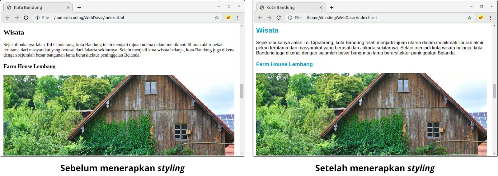

# Text Color
Pada modul pengenalan CSS, sebetulnya kita sudah mencoba dengan mudahnya mengganti warna pada teks yang ditampilkan. Mungkin sebagian dari Anda sudah mengetahuinya. Sejujurnya, bagi Anda yang sudah mengerti tentang ini, tidak ada lagi yang perlu dibahas di sini. Kita dapat dengan mudahnya mengganti warna teks menggunakan properti color.

Nilai dari properti color dapat berupa predefined color name atau sebuah numeric value dengan menggunakan RGB, RGBA, Hex, HSL, ataupun HSLA. Berikut contohnya, seluruh elemen 
 akan diberi warna abu-abu (gray) dengan menggunakan beberapa cara.

p { color: gray; }
p { color: #666666; }
p { color: #666; }
p { color: rgb(102,102,102); }

Properti color dapat diaplikasikan ke seluruh elemen yang ada dalam HTML dan nilainya dapat diturunkan pada elemen turunannya. Jadi kita bisa mengubah warna teks dalam seluruh dokumen HTML dengan menerapkan properti color pada elemen body, seperti berikut.