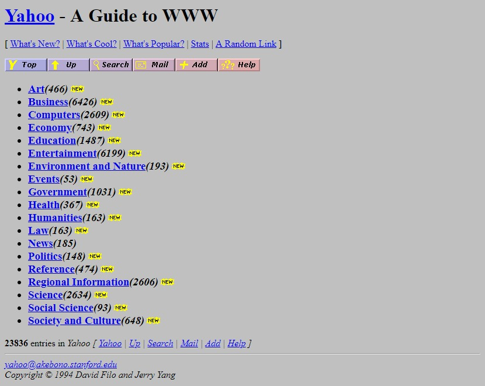
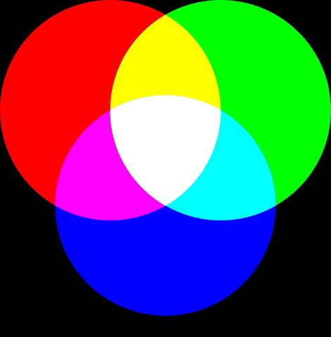
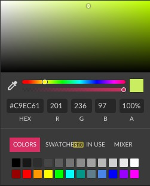
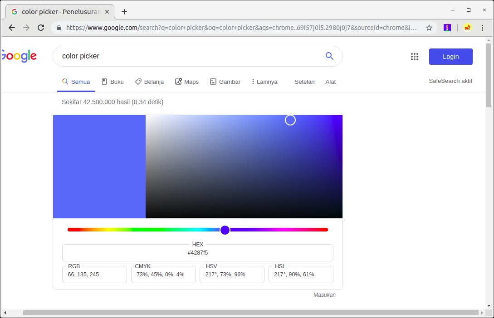

# Pewarnaan
Warna memberikan kesan hidup pada sebuah website. Jika kembali pada tahun 1993, kita akan hidup ketika website hanya memiliki background berwarna abu dengan teks hitam. Bisa dibayangkan betapa membosankan tampilan tersebut, kan?

Gambar di atas merupakan tampilan halaman dari situs Yahoo sebagai mesin pencari pada tahun 1994. Jika ingin melihat tampilan Yahoo lainnya dari tahun ke tahun, Anda dapat membuka tautan ini(https://www.webdesignmuseum.org/gallery/yahoo-1994 ).

Pada saat itu, memang belum ada browser yang dapat mengatur pewarnaan hingga hadirnya Netscape Navigator yang memungkinkan untuk melakukannya meskipun belum sesempurna saat ini. Syukurlah, kita cukup menggunakan properti-properti yang ada pada CSS untuk mengatur warna pada teks dan background pada saat ini. Terlebih, seluruh browser saat ini sudah mendukung styling menggunakan CSS sehingga kita tidak perlu memikirkan kompatibilitasnya.

Kali ini, kita akan membahas tentang pewarnaan pada CSS. Tentunya, caranya dengan mengenal properti yang digunakan untuk mengatur warna teks dan background. Namun sebelum itu, mari kita pelajari dahulu cara menetapkan warna pada CSS.

# Menetapkan Nilai Warna
Setiap warna pada layar komputer kita terdiri dari campuran warna merah, hijau, dan biru. Layar komputer dibuat dari ribuan kotak kecil yang biasa disebut piksel. Ketika layar monitor tidak menyala, piksel pun tidak akan menyala. Ketika layar monitor menyala, tiap piksel dapat menghasilkan warna yang berbeda sehingga dapat menampilkan gambar.

Dalam piksel terdapat tiga buah lampu kecil berwarna merah, hijau, dan biru. Ribuan warna dapat dihasilkan dari kombinasi tiga warna tersebut.

Ketika ingin menetapkan warna, kita tidak perlu menghafal kombinasi dari ketiga warna tersebut. Banyak pemilih warna untuk membantu kita dalam menetapkan warna yang diinginkan. Contohnya seperti color picker yang ada pada Photoshop, GIMP, atau Gravit Designer.

Kita bisa melihat nilai RGB yang dipilih melalui color picker. Lantas, bagaimana jika kita tidak memiliki aplikasi desain seperti yang telah disebutkan tadi? Tenang, sekarang color picker banyak tersedia online, bahkan ketika kita menuliskan “color picker” pada Google Search, tools tersebut tersedia pada hasil pencariannya.

Pada CSS, kita dapat menggunakan numeric value dan predefined color name untuk menetapkan nilai warna. Apakah kedua hal tersebut? Mari kita bahas satu per satu.

/* Warna hijau menggunakan format RGB */
color: rgb(78,231,23);
 
/* Warna hijau Menggunakan format HEX */
color: #4ee717;
 
/* Warna hijau menggunakan format HSL (hanya di CSS3)*/
color: hsl(104, 82%, 50%);

Kode tersebut merupakan nilai warna hijau yang dituliskan dalam beberapa format. Dari kode tersebut, kita tahu tidak hanya format RGB yang dapat digunakan dalam menetapkan warna, selain RGB ada format Hex dan HSL (Hue, Saturation, Light).

Predefined Color Name
Selain menggunakan format angka, menentukan warna juga dapat menggunakan sebuah kata, seperti blue, yellow, red dan lainnya.

color: black;
color: white;
color: blue;

 Dengan menggunakan kata, tentu kita dapat lebih mudah dan cepat dalam menentukan warna, tetapi mungkin hanya warna dasar yang dapat kita hafal. Sebab hampir seluruh browser saat ini mendukung 140 nama warna, kita dapat melihat apa saja warna yang tersedia pada pembahasan bertopik HTML color names dari w3schools.com.