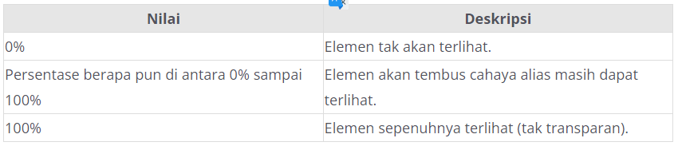

# Opacity
Apakah Anda pernah melihat suatu objek atau gambar yang tak terlihat atau tembus pandang? Pada dunia nyata, Anda dapat menemukan objek yang memiliki sifat tersebut. Contohnya adalah plastik mika. Jika mengingat tugas makalah di sekolah, biasanya plastik mika dibutuhkan sebagai sampulnya. Ia memiliki banyak macam warnanya, tetapi kita tidak membahas hal tersebut. Kita lebih fokus untuk berbicara tentang bahannya yang terlihat transparan.

Kertas tersebut memiliki tingkat opacity tertentu. Bayangkan ia adalah sebuah elemen HTML. Satu lembar mika akan memiliki tingkat opacity lebih kecil sehingga transparansinya semakin tinggi. Namun, bagaimana cara memperbesar tingkat opacity-nya? Jawabannya, tentu dengan menambah lembar mika menjadi dua, tiga, atau lebih. Alhasil, tingkat transparansinya semakin rendah. Inilah konsep dari opacity. Makin tinggi tingkat atau nilai opacity maka makin besar kemungkinan elemen HTML akan terlihat.

Mungkin sebagian dari Anda ada yang bertanya, “Apa perbedaan antara transparan dan opacity?” Jawabannya, transparan adalah seberapa besar tingkat tembus pandang atau tak terlihatnya suatu objek, sedangkan opacity adalah seberapa besar tingkat terlihat suatu objek. Semakin besar tingkat transparansi suatu objek, semakin tak terlihat objek tersebut. Namun, semakin besar tingkat opacity suatu objek, semakin terlihat objek tersebut (solid).

