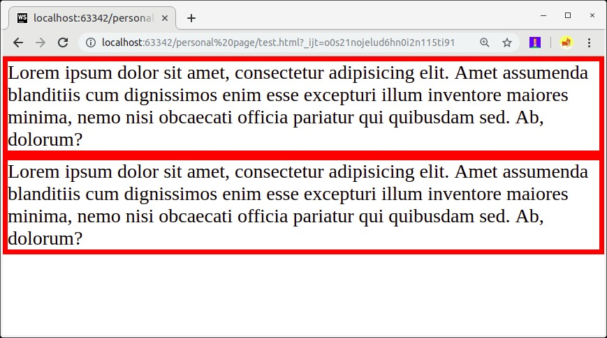
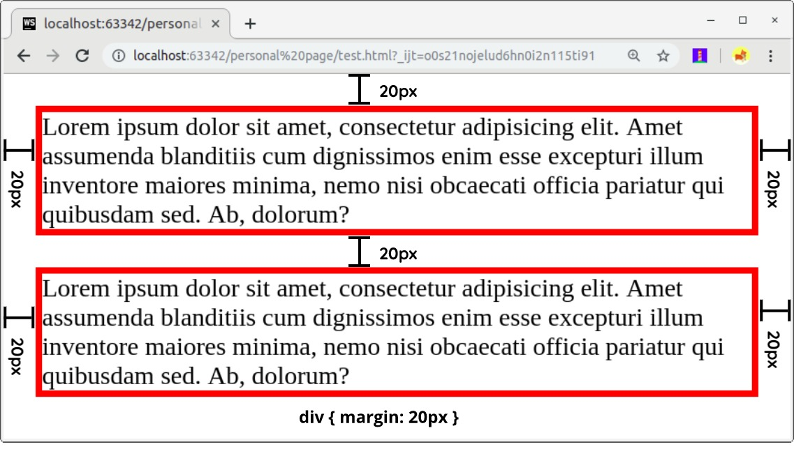

#  Margin
Seperti padding, margin merupakan ruang atau jarak pada sebuah elemen. Namun, jarak tersebut terletak diluar dari konten dan border element. Margin digunakan untuk menjaga elemen agar tidak bertabrakan satu sama lain atau dari tepi jendela browser.

sebelum menggunakan margin

setelah menggunakan margin

Margin ini bersifat collapsed, yang artinya dapat menumpuk jika terdapat dua margin yang saling bertumpukkan. Kalian bisa melihat pada margin bawah dan margin atas pada kedua elemen tersebut. Hal itu menjelaskan alasan jarak vertikal antar elemen tersebut tidak sebesar 40px, tetapi sebesar 20px. Jika terjadi pertumpukan margin, nilai yang paling besar yang akan diterapkan.

Kita dapat menentukan nilai margin yang berbeda untuk masing-masing sisi elemen dengan menggunakan contoh daftar properti berikut.

margin-top: 10px;
margin-right: 15px;
margin-bottom: 20px;
margin-left: 25px;

Selain itu, kita juga dapat menggunakan shorthand untuk menetapkan keempat nilai di atas dalam satu properti berikut.

margin: 10px 15px 20px 25px;

Kita juga bisa menggunakan dua nilai saja untuk menentukan nilai margin vertikal dan horizontal.

/* top dan bottom bernilai 10px, left dan right bernilai 15px */
margin: 10px 15px;