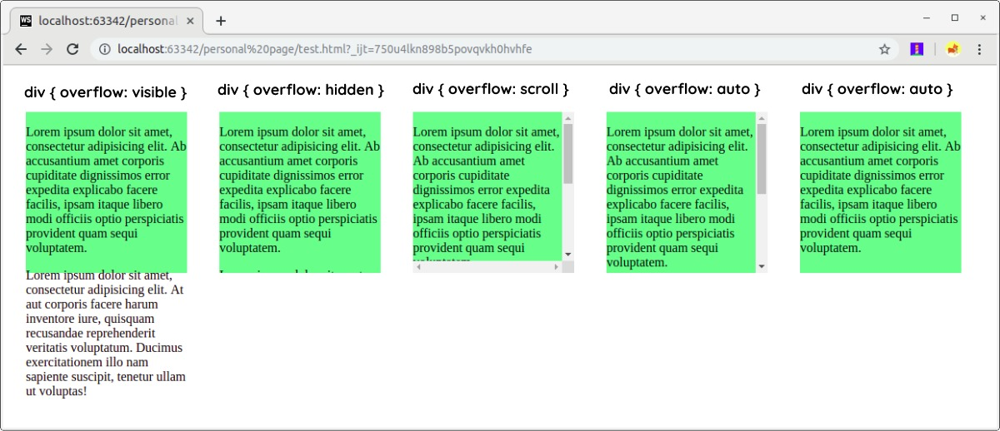

# Overflowing Content
Dimensi box yang dihasilkan elemen selalu cukup untuk menampung konten, tetapi hal ini tidak berlaku jika kita tetapkan secara manual panjang dan lebarnya. Tak jarang terjadi overflow ketika kita menerapkan ukuran pada elemen dengan konten di dalamnya yang begitu banyak.

Contohnya berikut.

<!DOCTYPE html>
<html>
  <head>
    <meta charset="UTF-8" />
    <title>Judul Dokumen</title>
    
    <link rel="stylesheet" href="styles.css" />
  </head>
  <body>
    

      

        Lorem ipsum dolor sit amet, consectetur adipisicing elit. Ab accusantium amet corporis
        cupiditate dignissimos error expedita explicabo facere facilis, ipsam itaque libero modi
        officiis optio perspiciatis provident quam sequi voluptatem.
      

      

        Lorem ipsum dolor sit amet, consectetur adipisicing elit. At aut corporis facere harum
        inventore iure, quisquam recusandae reprehenderit veritatis voluptatum. Ducimus
        exercitationem illo nam sapiente suscipit, tenetur ullam ut voluptas!
      

    

  </body>
</html>

div {
  height: 200px;
  width: 200px;
  background-color: lightgreen;
}

Untuk menangani kasus seperti ini kita bisa gunakan properti overflow, properti ini dapat bernilai berikut.

* visible
Visible merupakan nilai default pada properti ini. Konten yang tidak tertampung (overflow) akan tetap ditampilkan seperti pada standarnya.

* hidden
Jika terjadi overflow, konten yang tidak tertampung akan disembunyikan.

* scroll
Memunculkan scroll bar pada pinggir elemen sehingga konten yang tidak tertampung akan ditampilkan dengan scroll bar. Jika menggunakan nilai ini, scroll bar akan tetap muncul walaupun konten tidak terjadi overflow.

* auto
Sama seperti scroll, hanya jika tidak terjadi overflow, nilai visible yang akan diterapkan.

