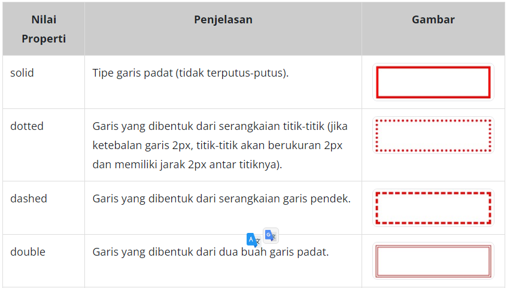

# Border Style
Kita bisa menetapkan tipe border dengan menggunakan properti border-style. Berikut adalah nilai-nilai yang dapat digunakan pada properti ini.

Kita juga bisa menetapkan tipe garis secara individual pada sisi elemen dengan menggunakan empat properti terpisah. Contohnya berikut.

<!DOCTYPE html>
<html>
  <head>
    <meta charset="UTF-8" />
    <title>Judul Dokumen</title>
    
    <link rel="stylesheet" href="styles.css" />
  </head>
  <body>
    

  </body>
</html>
