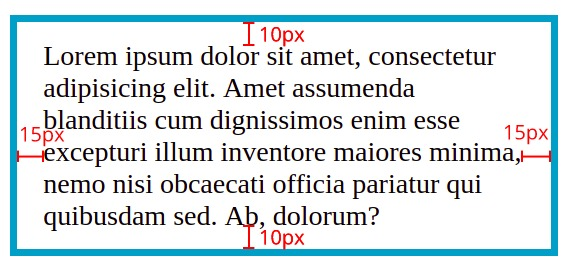

# Padding
Padding merupakan jarak antara area konten dan border. Padding banyak diterapkan pada elemen jika elemen tersebut menerapkan warna latar atau pun border. Padding memberikan sedikit ruang sehingga konten di dalam elemen dapat lebih nyaman untuk ditampilkan.

Berikut adalah contoh implementasi dari padding.

<!DOCTYPE html>
<html>
  <head>
    <meta charset="UTF-8" />
    <title>Judul Dokumen</title>
    
    <link rel="stylesheet" href="styles.css" />
  </head>
  <body>
    

      Lorem ipsum dolor sit amet, consectetur adipisicing elit. Aspernatur beatae commodi
      dignissimos eaque fugiat inventore maiores neque nisi sint.
    

    

      Lorem ipsum dolor sit amet, consectetur adipisicing elit. Amet assumenda blanditiis cum
      dignissimos enim esse excepturi illum inventore maiores minima, nemo nisi obcaecati officia
      pariatur qui quibusdam sed. Ab, dolorum?
    

  </body>
</html>

p {
  border: 4px solid #00a2c6;
  width: 350px;
}

p.example {
  padding: 10px;
}

Seperti yang kita lihat, paragraf kedua jauh lebih nyaman dibaca karena terdapat jarak antara teks dan border dari kotak. Kotak pun menjadi sedikit lebar karena ada padding.

Piksel merupakan satuan yang sering digunakan dalam menetapkan nilai properti ini (meskipun kita bisa juga menggunakan persentase atau ems). Jika menetapkan menggunakan persentase, nilai akan relative pada elemen induk atau jendela browser (jika tidak memiliki induk elemen).

Kita dapat menentukan nilai padding yang berbeda untuk masing-masing sisi elemen dengan menggunakan daftar properti berikut.

padding-top: 10px;
padding-right: 15px;
padding-bottom: 10px;
padding-left: 15px;

Selain itu, hal di atas dapat juga dilakukan dengan menggunakan shorthand seperti berikut.
padding: 10px 15px 10px 15px;

Berikut hasil dari penerapannya.

