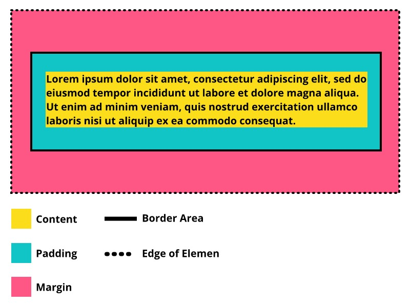

# Box Model
Pada pembahasan background-color disinggung bahwa setiap elemen ditampilkan seperti sebuah boxes atau kotak. Setiap elemen yang dibuat pada HTML akan menciptakan sebuah kotak untuk menampung kontennya. Layaknya bentuk kotak pada umumnya, ada beberapa nilai atau komponen padanya.

* Lebar dan tinggi pada kotak (konten).
* Ruang kosong antara konten dengan border (padding).
* Garis tepi (border).
* Jarak dari elemen lain (margin). 

Pada CSS, kita dapat mengatur nilai-nilai tersebut. Inilah yang disebut dengan box model.

Sebetulnya, kita sudah menyinggung sedikit mengenai konsep box model bekerja pada latihan sebelumnya. Kita telah mengimplementasikan padding pada elemen footer. Apakah Anda masih ingat apa yang dihasilkan dari penerapan tersebut? Jika tidak ingat, silakan periksa kembali pada latihan Menetapkan Ukuran, Ketebalan, dan Alignment Teks di Halaman Profil.

Pada materi ke depan, kita akan membahas lebih lanjut tentang properti-properti yang dapat memanipulasi boxes tersebut. Sebelum itu, kita pahami terlebih dahulu tentang konsep box pada elemen HTML untuk mendapatkan gambaran tentangnya.

# Apa Itu Box Element

Sebagaimana yang kita lihat pada gambar di atas, setiap elemen pada HTML, baik block-level maupun inline-level, akan menghasilkan kotak elemen. Gambar di atas adalah website milik dicoding.com dengan menerapkan CSS berikut.

* {
  border: 1px solid red;
} 

Perhatikan ilustrasi berikut untuk lebih jelasnya.

Berikut adalah penjelasan dari gambar di atas

* Content
Content atau konten merupakan sebuah inti dari kotak elemen yang merupakan konten dari elemen itu sendiri.

* Padding
Area yang menjadi jarak antara border elemen dengan konten yang ditampilkan. Ketika kita menerapkan background-color, warna tersebut diterapkan pada area padding. Penerapan ukuran padding pada elemen adalah opsional.

* Border
Border merupakan garis yang mencakup konten beserta padding. Penerapan border pada elemen adalah opsional.

* Margin
Berbeda dengan padding, margin merupakan area jarak di luar border. Pada ilustrasi di atas, margin ditunjukkan dengan warna merah muda. Namun, pada aslinya margin selalu transparan dan penerapan margin pada elemen adalah opsional.

* Edge of Element
Edge of element merupakan batas dari suatu elemen. Di dalamnya terdapat margin, border, padding, dan konten. Pada ilustrasi di atas, batas elemen ditunjukkan dengan garis putus, tetapi pada aslinya batas elemen selalu tidak terlihat.