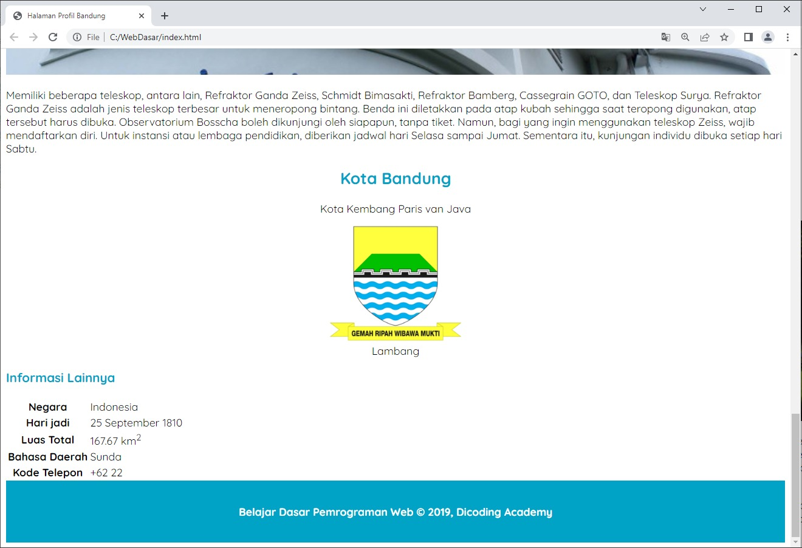

# Latihan Menetapkan Ukuran pada Gambar
Latihan ini terdiri dari beberapa topik yang saling terhubung. Untuk itu, berikut adalah daftar langkah latihan yang perlu diikuti dan disimak agar latihan berjalan dengan baik.

Silakan buka proyek Halaman Profil terakhir dengan VSCode. Jika belum memilikinya, silakan Anda unduh dan buka proyek tersebut pada GitHub repository ini.
Kita akan melakukan styling pada elemen gambar yang kita miliki dengan mengubah ukuran dimensinya. Pada berkas style.css, buatlah CSS rule baru untuk selector .featured-images dengan properti dan nilai sebagai berikut.

2. Kita akan melakukan styling pada elemen gambar yang kita miliki dengan mengubah ukuran dimensinya. Pada berkas style.css, buatlah CSS rule baru untuk selector .featured-images dengan properti dan nilai sebagai berikut.

.featured-image {
  width: 100%;
  max-height: 300px;
}

3. Apakah Anda bingung dengan selector di atas? Jika ya, hal tersebut sangat wajar. Hal ini karena memang kita belum memiliki elemen dengan class bernilai featured-image. Selector tersebut perlu kita terapkan pada seluruh elemen gambar, kecuali logo Kota Bandung dalam elemen <aside>. Untuk menerapkannya, silakan tambahkan atribut class dengan nilai featured-image.

<!DOCTYPE html>
<html>
  <head>
    <!-- Kode lainnya disembunyikan... -->
  </head>
  <body>
    <header>
      <!-- Kode lainnya disembunyikan... -->
    </header>
    <main>
      <!-- Konten artikel -->
      

        <article id="sejarah">
          <h2>Sejarah</h2>
          
          <!-- Kode lainnya disembunyikan... -->
        </article>
 
        <article id="geografis">
          <h2>Geografis</h2>
          
          <!-- Kode lainnya disembunyikan... -->
        </article>
 
        <article id="wisata">
          <h2>Wisata</h2>
          <!-- Kode lainnya disembunyikan... -->
          <section>
            <h3>Farm House Lembang</h3>
            
            <!-- Kode lainnya disembunyikan... -->
          </section>
          <section>
            <h3>Observatorium Bosscha</h3>
            
            <!-- Kode lainnya disembunyikan... -->
          </section>
        </article>
      

 
      <!-- Konten samping -->
      <aside>
        <!-- Kode lainnya disembunyikan... -->
      </aside>
    </main>
    <footer>
      
Belajar Dasar Pemrograman Web &#169; 2019, Dicoding Academy

    </footer>
  </body>
</html>

4. Setelah menerapkannya, tampilan gambar akan menjadi seperti berikut.

5. Wah, apa yang telah terjadi? Tiba-tiba gambar ditampilkan secara tidak proporsional. ia ditampilkan memenuhi lebar dari viewport (jendela browser). Namun, karena kita menetapkan properti max-height juga, gambar tidak ditampilkan dengan ukuran yang tidak imbang. Solusinya, kita tambahkan properti object-fit: cover dan object-position: center pada selector .featured-image.

.featured-image {
  width: 100%;
  max-height: 300px;
  object-fit: cover;
  object-position: center;
}

6. kedua properti yang telah kita terapkan di atas membuat gambar yang ditampilkan dapat mempertahankan kualitas rasio aslinya meskipun ukuran lebar dan panjang dari elemen gambar tidak imbang. Namun, untuk menghasilkan perbaikan gambar ini, ada area gambar yang terpotong atau tidak ditampilkan (crop).

Jika di antara Anda ada yang berpikir, “Jika gambar tersebut di-crop, apakah kita bisa memilih letak potongan yang ditampilkan?”. Jawabannya bisa. Kita bisa memanfaatkan object-position untuk melakukannya.

7. Selanjutnya, kita atur juga ukuran logo Kota Bandung pada elemen <aside>. Agar logo tampak tidak terlalu besar, kita atur properti width sebesar 200px. Silakan tambahkan kode bercetak tebal berikut pada berkas style.css untuk membuat CSS rules baru dengan selector .profile img dan menulis properti width beserta nilainya. 

.profile img {
  width: 200px;
}

Hasil akhir perubahan ini, logo akan tampak lebih kecil seperti berikut.

Itulah latihan yang telah kita lakukan pada materi ini. Seperti biasanya, kami menyediakan beberapa referensi materi yang dapat Anda simak untuk menambah pengetahuan.