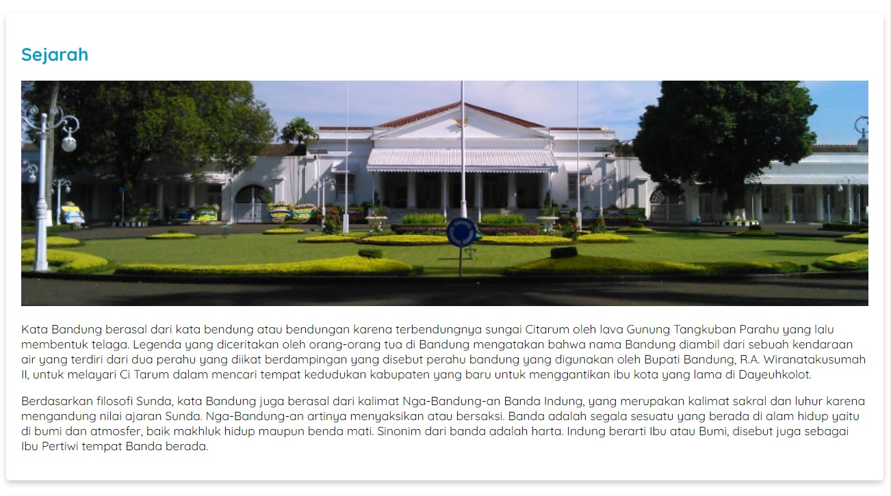

# Latihan: Menerapkan Card Style pada Elemen Article
Menetapkan dimensi elemen telah kita lakukan. Nah, latihan ini, kita akan melanjutkan lagi untuk menerapkan konsep box model lainnya. Bahkan, hal yang sangat asyik, kita akan memberikan efek bayangan terhadap elemen. Wah, tidak sabar berlatih, bukan? Yuk, simak latihan ini!

Tujuan
Apakah Anda merasa bosan dan memiliki ide dengan tampilan saat ini? Kami punya ide. Bagaimana kalau kita desain masing-masing topik agar tampil menjadi sebuah card? Berikut tampaknya.

Kita akan mengubah tampilan pada tiap elemen <article> agar memiliki efek card (kartu) dengan menerapkan properti box-shadow dan border-radius. Hasilnya akan seperti gambar di atas.

Wah, seharusnya ini menjadi hal yang menarik! Mari kita atur dan lanjutkan latihannya.
Alur Latihan
Berikut adalah alur latihan kali ini.

Membuka hasil latihan terakhir dengan VSCode.
Menerapkan efek kartu (card effect) pada elemen <article>.

Menjalankan dokumen HTML pada browser.

Latihan Menerapkan Card Style pada Elemen Article

Latihan ini terdiri dari beberapa topik yang saling terhubung. Untuk itu, berikut adalah daftar langkah latihan yang perlu diikuti dan disimak agar latihan berjalan dengan baik.

1. Silakan buka proyek Halaman Profil terakhir dengan VSCode.

2. Buatlah CSS rule baru dengan selector .card dan terapkan beberapa properti beserta nilainya sebagai berikut pada style.css.

.card {
  box-shadow: 0 4px 8px 0 rgba(0, 0, 0, 0.2);
  border-radius: 5px;
}

3. Apakah Anda masih ingat? Kita belum memiliki elemen dengan class card satu pun. Oleh karena itu, tambahkan atribut class bernilai card pada setiap elemen <article> dengan memperhatikan kode bercetak tebal.

4. Silakan jalankan halaman web ini pada browser dan perhatikanlah. Pada setiap sisi elemen <article> akan tampak dikelilingi oleh drop shadow dan memiliki sudut yang tumpul.

Jika dirasa drop shadow kurang terlihat jelas, Anda bisa mengubah nilainya sendiri. Agar mudah dalam menentukan porsi drop shadow yang cocok, kita dapat memanfaatkan tools yang tersedia secara online pada CSS Matic box shadow.

5. Tahap berikutnya, kita akan perbaiki tampilan konten dalam card agar tidak terlalu sempit dari sisi elemennya. Kita bisa mengaturnya dengan properti margin dan padding. Silakan tambahkan kode bercetak tebal berikut untuk menambahkan properti tersebut beserta nilainya pada rule .card.

Silakan jalankan hasil perubahan ini pada browser. Seharusnya, tampilan card menjadi seperti berikut.

Sekarang, konten di dalam card lebih enak dipandang dan ciamik, kan? Ataukah Anda tidak suka ukuran padding dan margin karena masih terlalu kecil? Ataukah bahkan lebih suka tidak menggunakan padding dan margin sama sekali? Silakan sesuaikan nilainya secara mandiri. Sip!