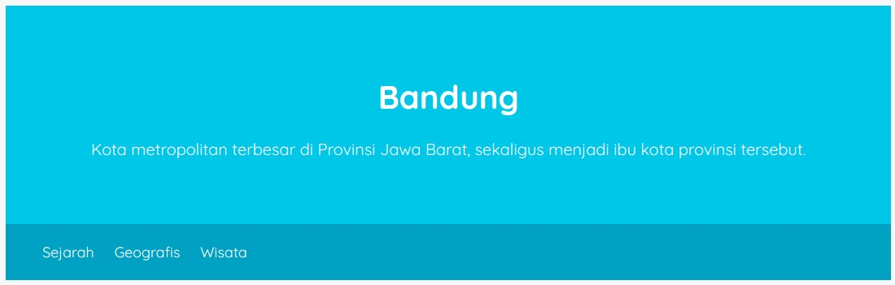
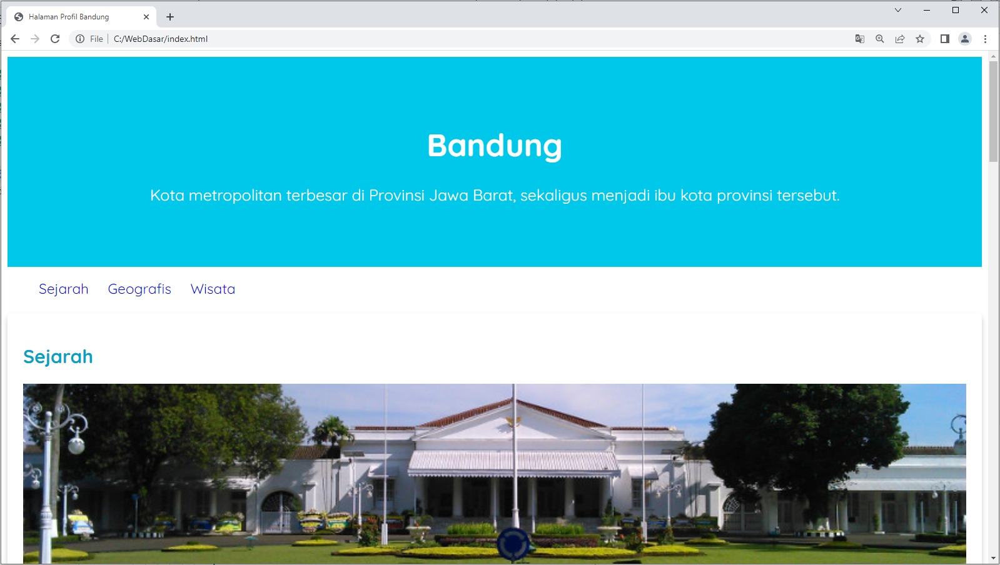
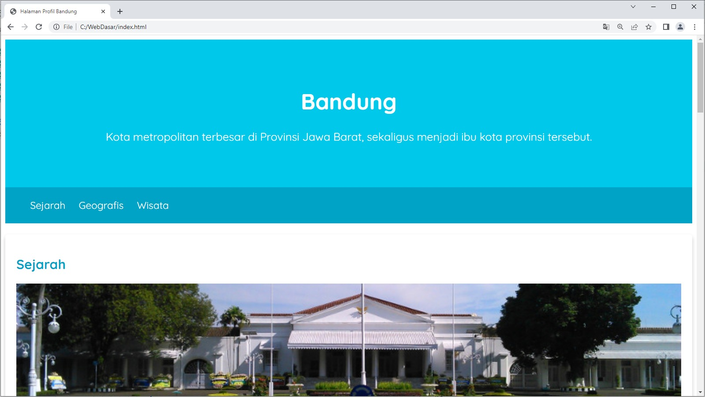

# Latihan: Menerapkan Jumbotron dan Navigasi pada Elemen Header
Pernahkah Anda merasa bosan dengan tampilan dari elemen header? Yup, sebenarnya kami pun juga merasakan hal yang sama. Nah, untuk mengatasi masalah ini, mengapa tidak kita restyling saja? Yuk, sikat latihannya!

Tujuan
Seharusnya, Anda masih ingat dengan elemen <header> dari halaman ini, bukan? Tampak terlihat membosankan jika tidak kita atur gayanya sebagaimana elemen sebelumnya. Oleh karena itu, kita akan mengatur header agar memiliki efek jumbotron dan tampilan navigasi agar lebih bagus. Hasil akhirnya akan tampak seperti berikut.

Mantap! Langsung saja kita sikat!

Alur Latihan
Berikut adalah alur latihan kali ini.

1. Membuka hasil latihan terakhir dengan VSCode.
2. Restyling elemen header agar tampak seperti jumbotron.
3. Menjalankan dokumen HTML pada browser.

Latihan Menerapkan Jumbotron dan Navigasi pada Elemen Header
Latihan ini terdiri dari beberapa topik yang saling terhubung. Untuk itu, berikut adalah daftar langkah latihan yang perlu diikuti dan disimak agar latihan berjalan dengan baik.

1. Silakan buka proyek Halaman Profil terakhir dengan VSCode.
2. Silakan buka berkas style.css dan buat CSS rule baru dengan selector .jumbotron. Jika sudah, terapkan beberapa properti beserta nilainya seperti berikut. Kode yang ditambahkan memiliki cetakan tebal.

.jumbotron {
  font-size: 20px;
  padding: 60px;
  background-color: #00c8eb;
  text-align: center;
  color: white;
}

3. Lalu, jangan lupa kita harus terapkan class jumbotron ini pada elemen <header> di berkas HTML. Untuk melakukannya, silakan bungkus elemen <h1> dan 
 di dalam <header> menggunakan elemen 
 dan berikan elemen ini class jumbotron.

Jadi, struktur HTML pada elemen <header> akan tampak seperti berikut.

<header>
  

    <h1>Bandung</h1>
    

      Kota metropolitan terbesar di Provinsi Jawa Barat, sekaligus menjadi ibu kota provinsi tersebut.
    

  

  <nav>
    <ul>
      <li><a href="#sejarah">Sejarah</a></li>
      <li><a href="#geografis">Geografis</a></li>
      <li><a href="#wisata">Wisata</a></li>
    </ul>
  </nav>
</header>

4. Alhasil, elemen header akan tampak dengan efek jumbotron.

5. Selesai dengan elemen jumbotron. Lanjut, kita akan memperbaiki tampilan navigasi juga agar terlihat cocok dengan header yang ditampilkan.

Sebagaimana biasanya, buatlah CSS rule baru dengan selector nav li. Selector tersebut akan mengatur elemen <li> yang menjadi turunan dari elemen <nav>--selain dari turunan <ul>. Berikan beber

nav li {
  display: inline;
  list-style-type: none;
  margin-right: 20px;
}

6. Nilai inline pada properti display akan membuat elemen <li> menerapkan sifat inline element. Hal ini menyebabkan elemen akan ditampilkan tanpa membuat baris baru. Selain itu, properti list-style-type dengan nilai none akan menghilangkan tanda titik yang dihasilkan bagi setiap item pada list.

Dengan demikian, navigasi akan tampak seperti berikut.

7. Selanjutnya, berilah background-color dan color pada navigasi agar tampak sesuai dengan header. Silakan buat CSS rule baru dengan selector nav dan atur dengan properti-properti tersebut beserta nilainya.

nav {
   background-color: #00a2c6;
   padding: 5px;
}

8. Kemudian, untuk mengatur warna teks pada navigasi, silakan tambahkan properti color pada selector nav a yang sudah kita miliki.

nav a {
  font-size: 18px;
  font-weight: 400;
  text-decoration: none;
 
  color: white;
}

Dengan demikian, navigasi akan terlihat sesuai dengan header yang ditampilkan.

