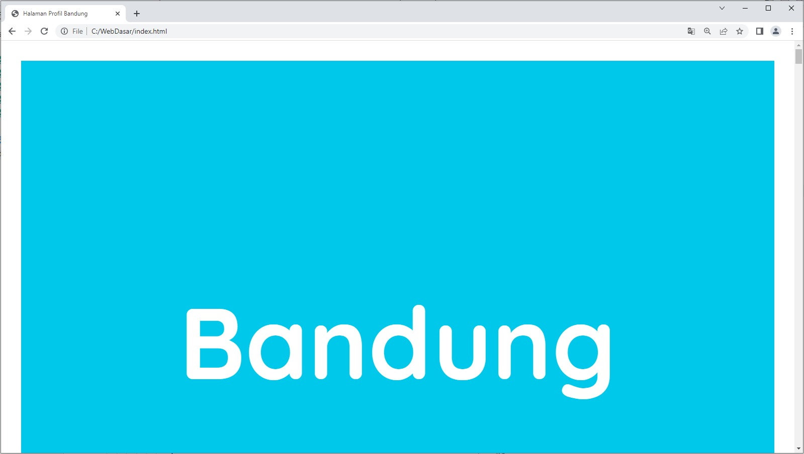
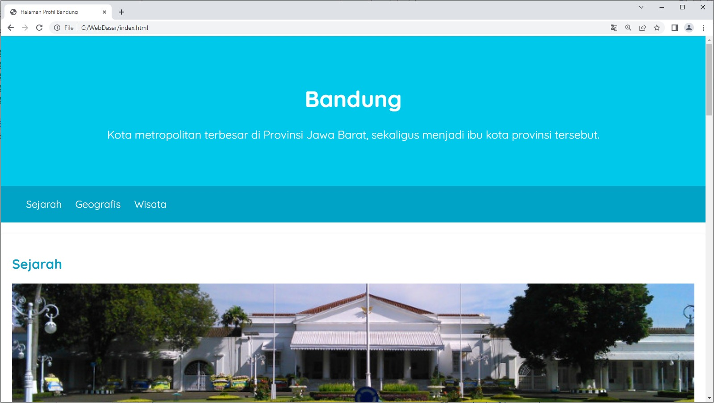

# Latihan: Menyesuaikan Padding dan Margin pada Elemen Body dan Main
Ada hal terakhir yang perlu kita lakukan sebelum beranjak ke materi berikutnya. Ini merupakan hal yang sangat penting dan perlu diketahui oleh Anda. Penasaran, kan? Yuk, simak latihan ini.

Tujuan
Sebenarnya, kita sudah selesai melakukan styling pada konten-konten Halaman Profil. Namun, kita masih ada satu hal lagi yang dapat ditingkatkan. Disadari atau tidak, sebenarnya ada sedikit celah yang terjadi pada elemen <body>. Anda akan melihat ada jarak antara konten halaman web dengan tepi viewport.

Silakan perhatikan gambar berikut.

Halaman web yang kita miliki sebetulnya ada sedikit celah sehingga konten kita tidak ditampilkan secara penuh dalam browser. Silakan Anda tebak apa yang membuat hal tersebut terjadi. Jika Anda menjawab adalah margin, marvelous!. Jawaban Anda benar. Ini merupakan styling yang dimiliki oleh browser (standar browser) terhadap elemen <body>. Jadi, Anda sudah tahu hal yang harus dilakukan, kan?

Catatan:
Gambar di atas merupakan halaman web yang diperbesar ukurannya hingga 500%. Tujuannya agar kita dapat melihat dengan jelas hal yang dimaksud dengan celah antara konten dengan viewport browser.

Meskipun demikian, kita akan mengatasi masalah ini bersama-sama. Yuk!

Alur Latihan
Berikut adalah alur latihan kali ini.

1. Membuka hasil latihan terakhir dengan VSCode.
2. Menghilangkan padding dan margin pada elemen <body> dan memberikan padding pada elemen <main>.
3. Menjalankan dokumen HTML pada browser.

Latihan Menyesuaikan Padding dan Margin pada Elemen Body dan Main

Latihan ini terdiri dari beberapa topik yang saling terhubung. Untuk itu, berikut adalah daftar langkah latihan yang perlu diikuti dan disimak agar latihan berjalan dengan baik.

1. Silakan buka proyek Halaman Profil terakhir dengan VSCode.
2. Kita akan menyesuaikan margin dan padding pada elemen <body> dan <main>. Pertama, kita hilangkan nilai margin dan padding dengan menuliskan properti margin dan padding bernilai 0 pada selector body. Silakan tambahkan kode bercetak tebal berikut.
body {
  font-family: 'Quicksand', sans-serif;
 
  margin: 0;
  padding: 0;
}

3. Dengan demikian, layout yang ditampilkan akan memenuhi seluruh lebar dan tinggi jika dijalankan di browser.

4. Namun, untuk konten di dalam elemen <main> perlu sedikit tambahan jarak agar dapat ditampilkan dengan lebih nyaman. Kita dapat atur jarak tersebut menggunakan padding pada selector main. Silakan tuliskan CSS rule baru dengan selector main dan beri ia nilai 20px pada properti padding. Tambahkan kode pada style.css dengan kode bercetak tebal berikut.

main {
  padding: 20px;
}

5. Itulah latihan yang telah kita lakukan pada materi ini. Pada latihan selanjutnya, kita akan mengatur tata letak Halaman Profil agar elemen div#content dan aside saling sejajar secara horizontal. Untuk melakukannya, kita harus mempelajari tentang positioning dan floating.