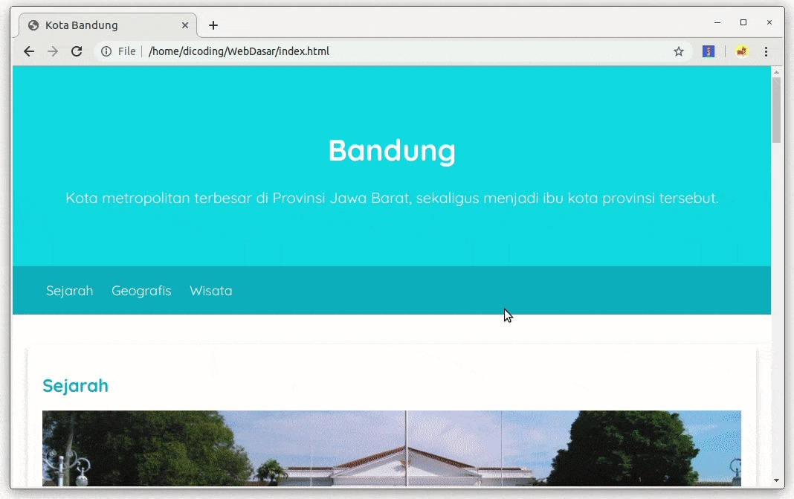
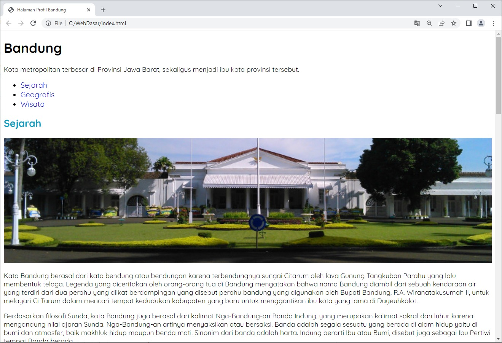
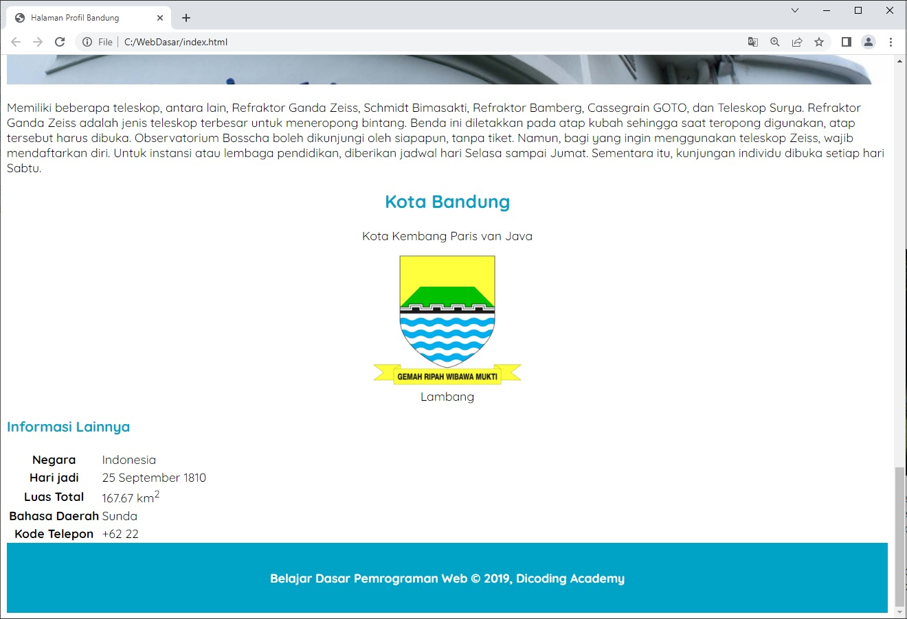

# Pengantar Latihan: Mengatur Box Model di Halaman Profil
Pada latihan sebelumnya, kita sudah menerapkan font yang didapatkan dari Google Fonts dengan properti font-family dan mengubah warna font dengan menggunakan properti color. Nah, setelah mempelajari komponen box seperti padding, border, dan margin saatnya kita terapkan pada proyek yang sudah kita buat sebelumnya, dimulai dari menetapkan ukuran gambar, membuat efek gaya kartu, hingga membuat jumbotron.

Pada akhir latihan ini, kita dapat mempercantik tampilan website profil supaya tampak seperti berikut.

Sudah siap, kan? Silakan buka kembali proyeknya dengan text editor yang Anda miliki.

# Latihan: Menetapkan Ukuran pada Gambar
Sebagai latihan awal, kita akan mengatur dimensi terlebih dahulu dari elemen gambar. Biar kami tebak, latihan ini terdengar mudah, bukan? Jika materi sebelumnya dipahami dengan baik, Anda pasti tahu hal yang perlu dilakukan di latihan ini. So, langsung saja berlatih!

Tujuan
Pada latihan sebelumnya, kita sudah menerapkan properti-properti CSS yang memanipulasi teks pada HTML. Nah, kita akan lanjut menerapkan beberapa properti lain yang dapat mengatur box model pada elemen HTML.

Pada latihan ini, kita akan mengatur tampilan gambar-gambar. Mereka berada pada seluruh elemen <article> (sejarah, geografi, dan wisata) serta elemen gambar dalam elemen <aside> (Logo Bandung).

Berikut adalah hasil akhir dari latihan ini.
Gambar untuk Elemen Article

Gambar untuk Logo Bandung

Alur Latihan
Berikut adalah alur latihan kali ini.

Membuka hasil latihan terakhir dengan VSCode.
Menetapkan dimensi gambar-gambar artikel dan logo Kota Bandung.
Memanfaatkan properti object-fit dan object-position pada elemen .
Menjalankan dokumen HTML pada browser.

Kedua properti yang telah kita terapkan di atas membuat gambar yang ditampilkan dapat mempertahankan kualitas rasio aslinya meskipun ukuran lebar dan panjang dari elemen gambar tidak imbang. Namun, untuk menghasilkan perbaikan gambar ini, ada area gambar yang terpotong atau tidak ditampilkan (crop).
