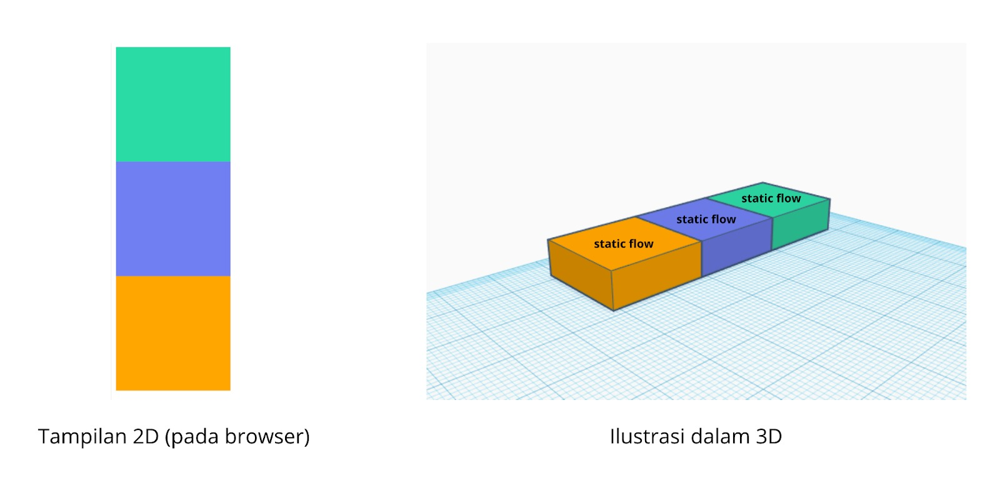
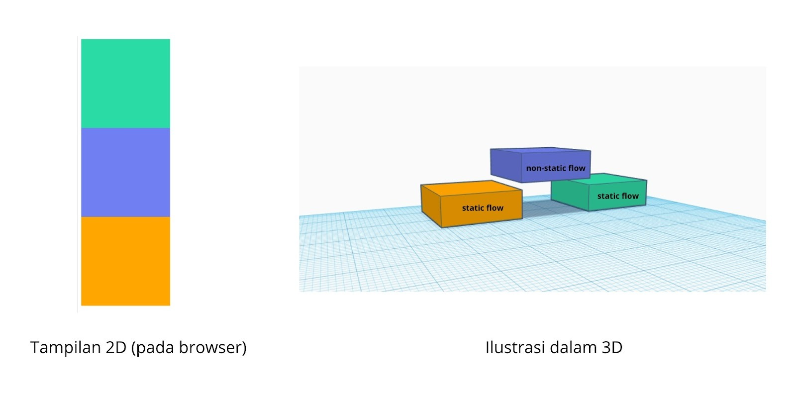
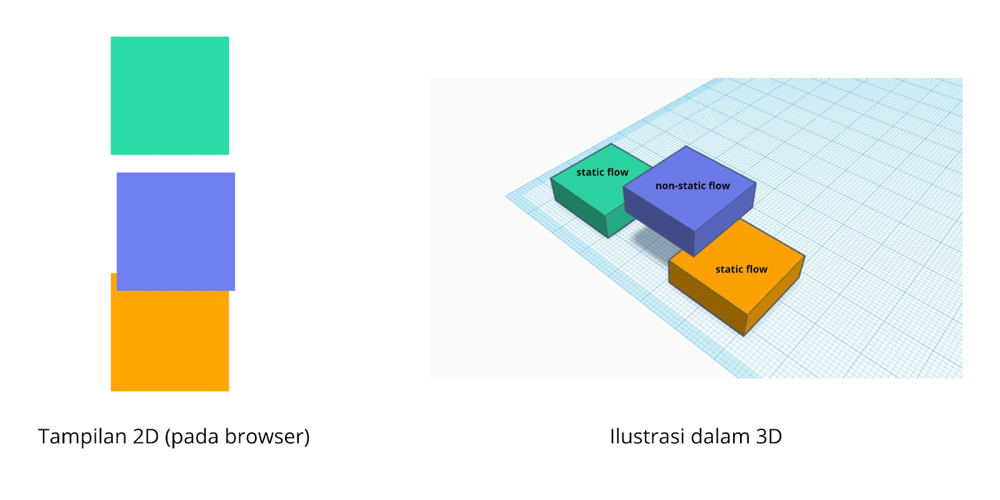

# Positioning: Perbedaan Static Flow dan Non-Static Flow
Sebenarnya CSS memiliki dua buah flow yang bisa digunakan untuk menampilkan elemen, yakni static dan non-static. Untuk mudah memahami perbedaan keduanya, kita gambarkan sebuah halaman website dengan tampilan tiga dimensi.

Bayangkan kita memiliki tiga buah elemen 
 berukuran 200 piksel ✕ 200 piksel yang masing-masingnya memiliki warna berbeda.

    .box {
        width: 200px;
        height: 200px;
      }
       
      .first {
        background-color: #60d0a8;
      }
       
      .second {
        background-color: #6495ed;
      }
       
      .third {
        background-color: #ffa500;
      }

Sebab kita tidak mengatur properti position dari ketiga elemen tersebut, tiap elemen akan ditampilkan dengan static flow seperti berikut.

Ketika ingin mengubah letak kotak biru (kotak kedua) dengan menggunakan margin-top: 20px, tentu akan berpengaruh pada posisi elemen di bawahnya.

.second {
  background-color: #6495ed;
  margin-top: 20px;
}

Berikut hasil representasinya.

Dalam tampilan browser mungkin tidak terdapat perbedaan apa pun setelah menerapkan nilai static pada atribut position. Namun, sebenarnya elemen yang menerapkannya akan diangkat dari luar static flow seperti yang ditampilkan pada ilustrasi 3D. Jadi, elemen tersebut dapat leluasa berpindah posisi tanpa memengaruhi elemen yang berada pada static flow.

Untuk mengubah posisi elemen yang berada di non-static flow, kita dapat menggunakan properti top, right, bottom, ataupun left.

  position: relative;
  top: 30px;
  left: 10px;

  

  Perlu diingat bahwa properti top, left, right, dan bottom hanya akan berpengaruh pada elemen yang menerapkan non-static flow, yaitu elemen yang menerapkan nilai relative, absolute, dan fixed pada properti position.