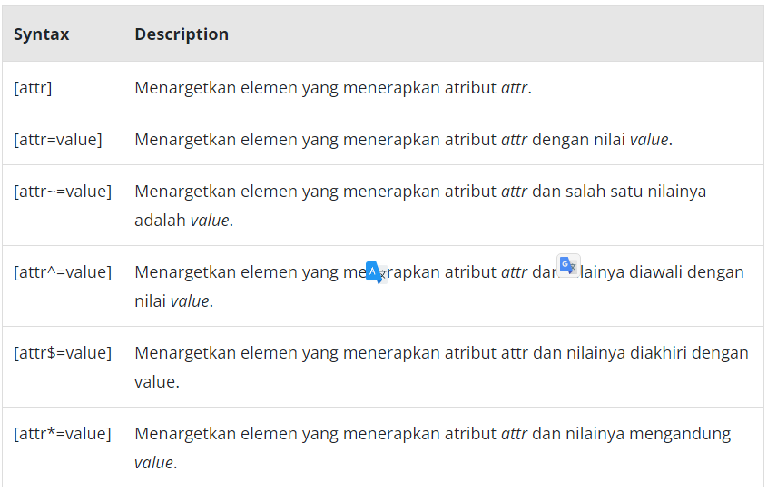

# Attribute Selector
Attribute selector merupakan cara menetapkan target elemen berdasarkan sebuah atribut yang digunakan atau bahkan bisa lebih spesifik dengan nilainya. Contohnya sebagai berikut.

<!DOCTYPE html>
<html>
  <head>
    <meta charset="UTF-8" />
    <title>Judul Dokumen</title>
    
    <link rel="stylesheet" href="style.css" />
  </head>
  <body>
    <ul>
      <ul>
        <li><a href="#internal">Internal link</a></li>
        <li><a href="http://example.com">Example link</a></li>
        <li><a href="#InSensitive">Insensitive internal link</a></li>
        <li><a href="http://example.org">Example org link</a></li>
      </ul>
    </ul>
  </body>
</html>

/* <a> element yang menerapkan href attribute */
a[href] {
  color: blue;
}

/* <a> element yang menerapkan nilai pada href dengan awalan "#" */
a[href^='#'] {
  background-color: gold;
}

/* <a> element yang menerapkan nilai pada href yang mengandung teks "example" */
a[href*='example'] {
  background-color: silver;
}

/* <a> element yang menerapkan nilai pada href yang mengandung teks "insensitive" tidak mementingkan huruf kapital*/
a[href*='insensitive' i] {
  color: cyan;
}

/* <a> element yang menerapkan nilai pada href dengan akhiran ".org" */
a[href$='.org'] {
  color: red;
}

Dari kode di atas, terlihat banyak sekali kondisi yang dapat diterapkan pada attribut selector. Agar dapat lebih mudah memahaminya, mari kita rangkum dalam sebuah tabel

