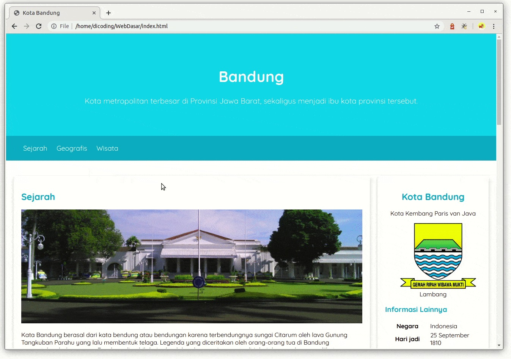

# Pengantar Pendalaman CSS
Pada modul sebelumnya, kita belajar banyak hal mengenai styling halaman web dengan CSS. Beberapa hal yang dipelajari, seperti pengertiannya, cara kerja, penulisan sintaks, hingga konsep yang ada, seperti inheritance, grouping selector, dan rule order. Tidak cukup kita membatasi diri pada materi-materi tersebut. Ada banyak sekali yang belum kita pelajari dan ulik terkait styling halaman web. Tentunya, kamu ingin membangun halaman web yang sangat menarik dan ciamik, kan?

Nah, kita akan berkenalan lebih dalam dan jauh lagi tentang CSS pada modul ini. Kita akan belajar beberapa hal, seperti mengenal berbagai macam tipe selector, formatting text, pewarnaan, box model, positioning, hingga penyusunan layout pada website menggunakan teknik floating. Selain itu, kita akan berlatih menerapkan seluruh ilmu yang sudah dipelajari pada beberapa latihan di modul ini. Penasaran seperti apa latihannya?

Pada penghujung modul ini, kita akan mengembangkan kembali Halaman Profil yang akan tampak seperti gambar berikut.

Hasilnya sangat menarik, bukan? Terlebih lagi, hasil tampilan halaman sebelumnya sangat sederhana dan tidak menarik.

Tunggu apa lagi! Langsung saja menuju ke materi berikutnya. Let’s go!